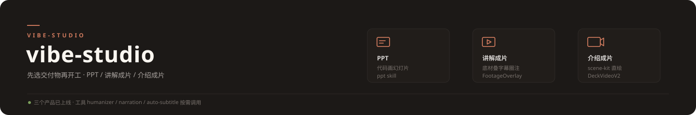

<div align="center">



# vibe-studio

**自媒体内容工厂** — 从项目说明到成片的一条流水线。

</div>

---

## 定位

TimeCraker 的内容创作工作台。不承载业务代码，只沉淀**内容生产能力**：

- **Skills** — 可独立运行的创作技能，自带模板代码，零外部依赖
- **Workflows** — 端到端工作流：项目 README → 介绍 deck → 逐页动效 → 视频成片
- **Assets** — 跨项目共享的品牌资源：色板、字体 token、版式范式

## Skills

| Skill | 做什么 | 状态 |
|---|---|---|
| [`ppt`](skills/ppt/) | python-pptx **代码画 PPT**：品牌色板 + 网格纪律 + 页面范式 + 逐元素动画（COM）+ morph 数据增长（真补间）+ 三级渲染核查 | 已上线 |
| [`humanizer`](skills/humanizer/) | 中英文**去 AI 腔**改写（blader 英文体系 × 中文三毒/L1-L4 工程体系融合 v5） | 已上线 |
| `vibe-motion` | 逐页动效编排：节奏、转场、镜头语言 | 规划中 |
| `deck-to-video` | deck 逐页渲染 → Remotion 合成，直接出成片 | 规划中 |

> **为什么代码画 PPT**：设计即代码——网格坐标、字号阶梯、色板全部显式声明，可复跑、可 diff、可版本化；渲染核查闭环保证「所见即所写」。

## 使用

进 vibe-studio 会话时其 `.claude/skills/` 自动生效；在其他项目用某 skill，复制或软链对应目录到该项目 `.claude/skills/`：

```bash
ln -s ~/Desktop/my-workspace/vibe-studio/skills/ppt <project>/.claude/skills/ppt
```

## 结构

```
vibe-studio/
├── skills/
│   ├── ppt/          # PPT 生成 skill
│   │   ├── SKILL.md       # 五步决策流程
│   │   └── templates/
│   │       ├── primitives.py   # 版式原语（网格/文本/图形/图表/转场）
│   │       ├── animate.py      # 逐元素动画（COM：fade/wipe/图表生长）
│   │       └── verify.py       # 渲染核查初筛（溢出检测 + 占位符扫描）
│   └── humanizer/         # 中英文去 AI 腔改写
│       └── SKILL.md       # v5 融合版（中英双体系）
└── assets/                # 品牌资源与 SVG
```

## 约定

- 每个 skill 必须可独立运行（自带模板，不依赖本仓库外文件）
- 决策记录进 `docs/`——选了什么、放弃了什么、为什么，避免后人重新踩
- 产物（pptx / pdf / 视频）不进 git，脚本可复跑
- 提交：Conventional Commits + 中英文对照

---

<div align="center">
<sub>© 2026 TimeCraker · <a href="https://asterforge.top">asterforge.top</a></sub>
</div>
