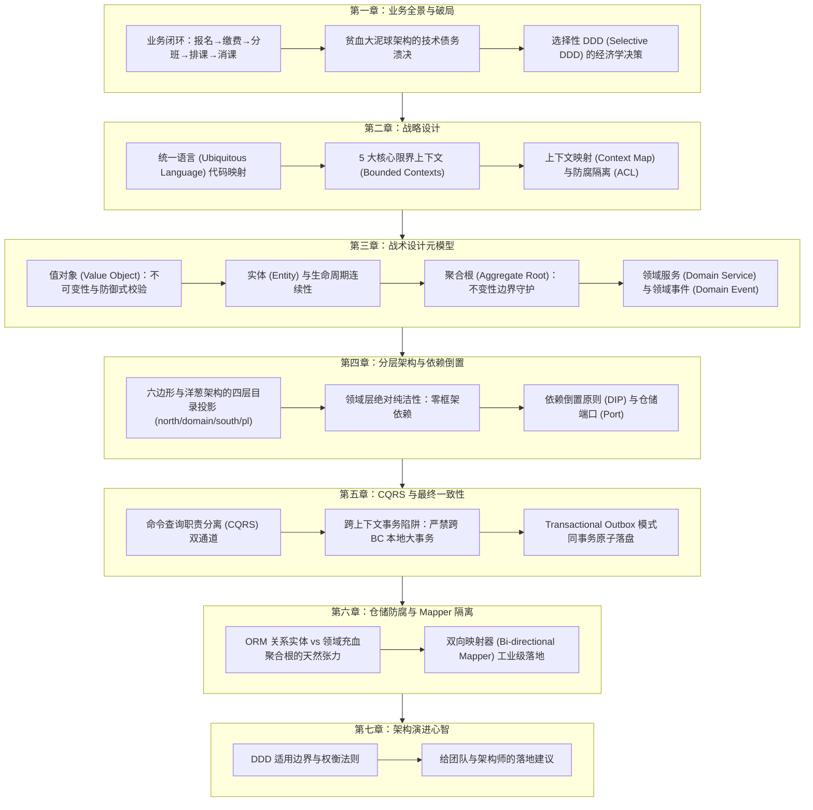
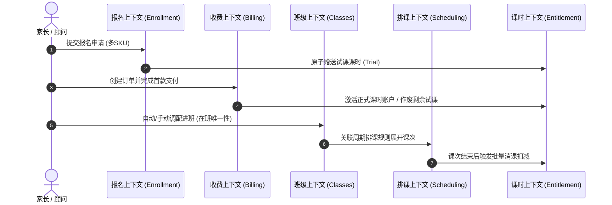
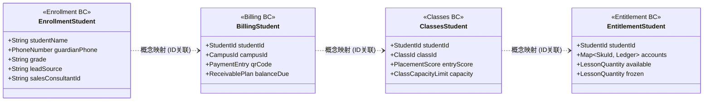
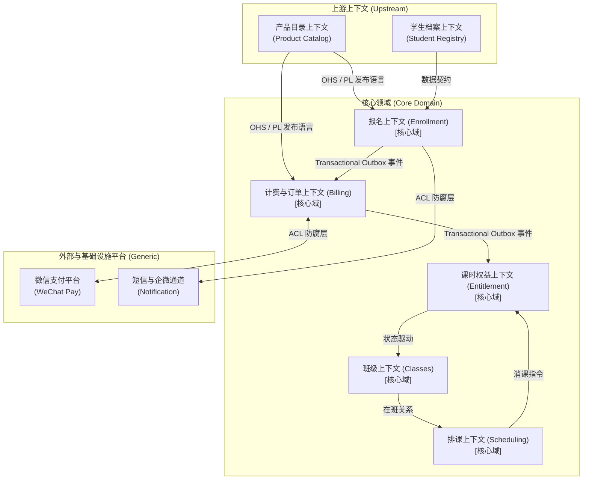
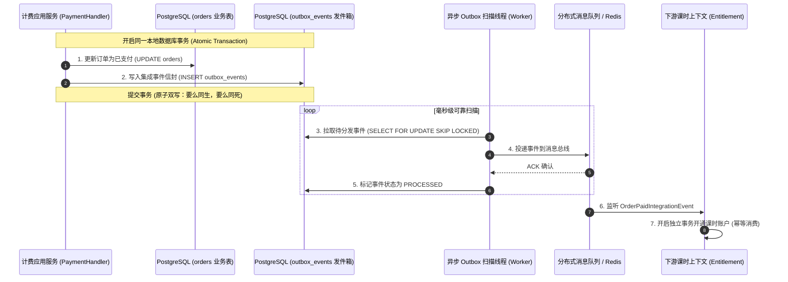
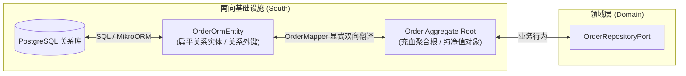
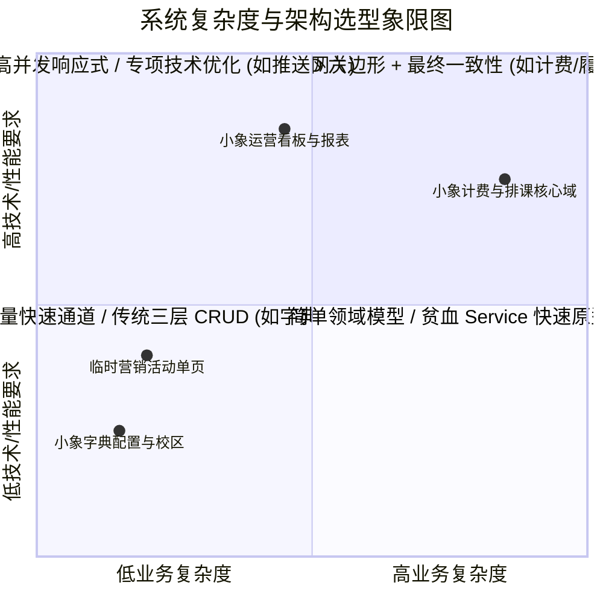

# 从理论到代码：基于小象培训管理系统的领域驱动设计 (DDD) 实战精要

> **演讲主题**：领域驱动设计 (Domain-Driven Design) 在现代化全栈系统中的架构演进与工程落地  
> **演讲时长**：40 分钟技术分享 / 深度研讨底稿  
> **作者**：TimeCraker · AI 时代独立架构师  
> **项目实证基线**：小象培训班管理系统 (`xiaoxiang-training-management`)  
> **技术栈环境**：TypeScript / NestJS / MikroORM (PostgreSQL) / CQRS / Transactional Outbox  

---

## 论文导读与演讲心智地图

领域驱动设计（Domain-Driven Design，简称 DDD）自 2003 年由 Eric Evans 提出以来，长期被诸多工程师视为“概念玄妙但难以下咽”的高岭之花。许多开发团队在面对日益臃肿的代码库时，言必谈“统一语言”、“聚合根”和“六边形架构”，然而实际代码一拉开，却依旧是贫血的数据库映射实体（Anemic Entity）配合动辄数千行的“上帝类”应用服务（God Service），只是给传统的增删改查（CRUD）套上了一层名为 `domain` 的目录外衣。

本文彻底跳过浮于表面的理论复述，以一套真实上线、具备完整工程闭环的商业化生产系统——**小象培训班管理系统（`xiaoxiang-training-management`）** 为唯一代码实证基线，采用 **“实战案例驱动”（理论 30% + 实战 70%）** 的叙事脉络，深入剖析 DDD 在现代软件工程中从战略拆解到代码落地的全景画卷。

全文共分为七章，整体心智演进路线如下：



---

## 第一章 业务全景与复杂度破局

### 1.1 真实业务闭环切入：培训机构的“五部曲”

任何脱离实际业务场景空谈架构模式的行为，都是无源之水。为了让 DDD 的各项抽象概念具备具象化的物理载体，我们首先审视真实线下培训教育机构的典型日常运营流程。

在一家面向中小学生的现代素质与学科培训中心，支撑其经营现金流与教学履约的核心业务闭环可以抽象为以下 **五个正交而又前后咬合的业务阶段**：

1. **报名（Enrollment）**：家长通过微信小程序或课程顾问在前台代建报名意向，系统支持单次提交包含多个课程规格（SKU）。在提交的瞬间，系统需要完成线索登记、来源渠道归因，并在同事务中原子赠送“体验试课机会”，生成试课课时，供学员即刻进班体验。
2. **缴费与订单（Billing）**：家长决定正式购课，系统生成课程商品包订单。这里存在极为复杂的财务规则：学员可以全款支付，也可以选择“首付 + 尾款”的分期支付形态；订单金额必须在多门打包课程的各个 SKU 之间进行收入分摊冻结；支付成功后需要处理外部掉单、微信异步回调重试、流水对账以及原路退款。
3. **分班（Classes）**：学员具备可用课时后进入待分班池。教务人员根据学生的年龄学段、意向科目、入学评测满分段（如 60%/70%/80%/90%）以及各班级容量上限（Capacity），通过算法建议或手动调配建立唯一的“在班关系”。
4. **排课（Scheduling）**：教研制定每周循环的周期排课规则（如每周二、四 18:30–20:00，在 302 教室由张老师授课）。排课引擎必须自动将抽象规则沿时间轴展开为具体的课次实例（Lesson Session），并在展开过程中实时进行毫秒级的“硬性资源冲突检测”（同一教室在同一时段禁止双重占用、同一教师在同一时段禁止分身授课）。
5. **消课与履约（Entitlement & Deduction）**：单次课程教学结束后，教师在员工端小程序发起批量消课。系统对出勤学员的课时账户进行扣减，生成不可篡改的复式变动流水。当试课学员的课时余额归零时，系统需自动触发事件结束其在班履约。



这一业务链路看似与传统的“电商下单 + 日程安排”类似，但深究其内部规则，就会发现其中蕴含着极高的内在业务复杂度。

---

### 1.2 传统三层架构 CRUD 在复杂业务下的溃败

在传统的三层架构（Controller $\to$ Service $\to$ DAO/Repository）与数据驱动开发模式下，团队的标准工作流通常是：**“先设计数据库表结构，再用代码生成工具生成实体类，最后在 Service 层堆砌业务逻辑”**。

这种模式在系统初期（简单的后台信息录入）极其敏捷高效，但一旦遇到上述培训机构的核心规则，代码库便会迅速滑向“大泥球架构”（Big Ball of Mud）：

#### 痛点一：贫血模型导致业务逻辑全链路外泄，系统失去“不变性防护”
在传统贫血模型中，实体仅仅是数据库字段的一对一映射，只拥有公有的 Getter 和 Setter，退化为单纯的“数据传输袋”（Data Bag）。
例如，订单状态字段 `status` 是一个普通的字符串或枚举，外部任何一段代码都可以肆意调用 `order.setStatus("PAID")`。
这就导致一个致命问题：**没有任何机制能够阻止非法状态跃迁**。一个已经取消（`CANCELLED`）的订单，可能因为某位新同学写的一段补偿脚本，直接被改成了已支付，而跳过了金额比对、库存校验和合同签署校验。业务规则被迫散落在数十个 Controller、Service、定时任务甚至前端代码中，系统千疮百孔。

#### 痛点二：财务分摊与账本审计规则在过程化代码中极易产生“精度漂移”与“资金差错”
在计费场景中，打包商品售价 2999 元，包含语文、数学、英语三门课程，每门课程标价各不相同。财务部门要求：必须在下单时刻冻结各 SKU 的收入确认分摊比例；在除不尽产生分厘差异时，末位 SKU 必须兜底补齐，确保分摊之和严格恒等于订单实收金额（不可变守恒）；如果支持首付款（如首付 30%），首付款与尾款金额同样必须守恒。
在传统的过程化 Service 中，这类逻辑充斥着大量的浮点数除法、四舍五入与临时变量，一旦某处漏算了 1 分钱，月度对账就会导致成千上万条平账差错单。

#### 痛点三：数据库表级强耦合，阻断了模块的独立演化
在三层架构中，为了查询方便，开发人员习惯性地使用 SQL 多表关联查询（`JOIN`）：
```sql
-- 传统三层中极其常见的跨域大联表：直接击穿了所有模块边界
SELECT o.order_no, s.student_name, c.class_name, e.available_quantity 
FROM orders o
JOIN students s ON o.student_id = s.id
JOIN class_enrollments ce ON s.id = ce.student_id
JOIN classes c ON ce.class_id = c.id
JOIN entitlement_accounts e ON s.id = e.student_id AND e.sku_id = o.sku_id
WHERE o.status = 'PAID';
```
这类 SQL 表面上写起来一行搞定，但其背后带来的毁灭性后果是：**将订单、学生主档、班级、排课、课时账户五张大表在数据库层死锁在一起**。未来无论想重构其中任何一个模块的表结构，或者将财务模块拆分为独立服务，整套系统的 SQL 都会全部崩塌。

---

### 1.3 破局之道：为什么选择 DDD 与“选择性 DDD”策略

领域驱动设计的核心哲学，是**将软件开发的核心重心从“数据存储介质（数据库/表结构）”转移到“业务领域内核（业务逻辑/领域模型）”上来**。
DDD 强调：
1. **统一语言**：以业务专家的术语为唯一真理，代码就是活的 PRD 文档。
2. **战略划分**：用限界上下文圈定语义边界，杜绝“全能大上帝实体”。
3. **战术内聚**：通过充血聚合根守护业务规则不变性，让对象对自己的数据与行为负全责。
4. **技术解耦**：通过依赖倒置原则，让数据库、网络协议、第三方 SDK 统统变成外围可插拔的插件。

#### 拒绝教条：选择性 DDD（Selective DDD）的经济学决策
然而，在真实企业工程中，最容易犯的错误就是“拿着锤子看什么都是钉子”的**教条主义 DDD**。很多架构师一旦引入 DDD，便要求系统里哪怕一个简单的“校区字典表”或者“系统参数配置”都要建立聚合根、仓储接口、防腐层和 CQRS Handler，导致系统凭空多出海量的样板代码，开发效率断崖式下跌。

在 `xiaoxiang-training-management` 系统中，我们贯彻了极为清醒的 **选择性 DDD（Selective DDD）** 策略：

| 领域分类 | 包含模块 | 架构选型 | 核心考量与经济学收益 |
|---|---|---|---|
| **核心域 (Core Domain)** | 报名 (Enrollment)、计费 (Billing)、班级 (Classes)、排课 (Scheduling)、课时权益 (Entitlement) | **严格 DDD 六边形架构**（聚合根 + 仓储 Port + Outbox 最终一致性） | 业务逻辑高度多变且复杂，涉及资金安全、排课冲突、复式流水，值得投入最高的工程标准进行严格内聚与单测守护。 |
| **支撑域 (Supporting Domain)** | 产品目录 (Product Catalog)、学生主档 (Student Registry)、组织校区 (Org Campus) | **经典三层架构 CRUD**（Controller $\to$ Service $\to$ ORM Entity） | 业务规则极其稳定，主要以属性维护和关联读取为主，直接采用简化的三层模式，最大化人效。 |
| **通用域 (Generic Domain)** | 身份权限 (Identity / IAM)、业务通知 (Notification)、系统配置 (Business Config) | **无状态基础服务 / SDK 适配器** | 纯粹的基础设施支撑能力，采用标准模块化集成，不侵入业务领域。 |

---

## 第二章 战略设计：从统一语言到限界上下文

战略设计（Strategic Design）是 DDD 的顶层灵魂。如果战略设计画错了边界，战术设计代码写得再优雅，最终也只会演变成一个“高度面向对象的分布式大泥球”。

### 2.1 统一语言 (Ubiquitous Language) 的工程具象化

很多团队认为统一语言只是一份挂在 Wiki 上的名词对照表，开发人员写代码时依然各自为政。在 `xiaoxiang-training-management` 中，统一语言是**直接编译在代码仓库中的强类型契约**。

#### 案例剖析：消除“多义性鸿沟”
在系统研发之初，业务运营人员常说：“给这个孩子送两节试听课”、“看看他还有没有体验资格”、“这个单子收了定金，尾款什么时候结”。
在传统开发中，程序员往往按直觉定义数据库字段：
```typescript
// ❌ 典型的反模式：开发人员自行脑补的技术行话与缩写
const is_auditing = 1;      // 是试听还是体验？
const deposit = 500;        // 500是元还是分？定金还是首付款？有法律区别！
const balance_days = 30;    // 尾款什么时候到期？从哪一天开始算？
```
在 DDD 实践中，团队必须与业务专家坐在一起，通过事件风暴（Event Storming）严格收敛术语定义，并强制将术语固化为代码层面的符号：

```typescript
// ✅ 统一语言在代码中的具象化体现
// 1. 试课机会 (Trial Opportunity) 与 试课权益 (Trial Entitlement) 严格区分
export type EntitlementAccountType = "TRIAL" | "FORMAL" | "GIFT";

// 2. 款项形态：全款 (FULL) vs 分期 (INSTALLMENT)；首付款 (Deposit) vs 尾款 (Final Payment)
export type PaymentForm = "FULL" | "INSTALLMENT";

// 3. 业务值对象直接承载概念规则
export class DepositRatio extends ValueObject<number> { ... } // 首付比例：固定 30%，不可随意传参
export class FinalDueDays extends ValueObject<number> { ... } // 尾款账期：首付付清后第 30 天 23:59:59 截止
```
当代码中的类名、方法名、枚举值与业务人员口中的语言达到 100% 同构时，PRD 文档与代码之间的“翻译损耗”便被彻底消除了。代码变动即是业务演进，代码审查即是业务规则审计。

---

### 2.2 限界上下文 (Bounded Context) 划分的黄金边界

DDD 战略设计的核心精髓，在于承认：**在软件系统中，不存在一个适用于所有场景的“全局通用模型”（Universal Model）**。同一个现实实体，在不同的业务语境下，其关注的属性、行为和生命周期有着本质的差异。

#### 经典误区：“大一统的学生模型”
在很多劣质架构中，存在一个包含 80 多个字段的巨大 `Student` 类：里面既有基本信息（姓名、年龄、监护人），又有销售信息（跟进顾问、意向级别），还有教学信息（所在班级、历史成绩），甚至还包含财务信息（累计缴费、未付尾款、剩余课时）。

#### DDD 的解法：以限界上下文解构概念边界
在本项目中，我们将系统划分为五个核心限界上下文，同一个“学生”概念在各个上下文拥有完全独立、高度自治的模型投影：



1. **报名上下文 (`Enrollment`)**：关注的是线索转化。它只关心学生姓名、监护人手机号、生源渠道、负责顾问以及试课意向。
2. **计费上下文 (`Billing`)**：关注的是资金与应收。它根本不需要知道孩子的年级或爱好，只关心该学员对应的付款人 ID、待缴应收单、分期到期日和发票凭证。
3. **班级上下文 (`Classes`)**：关注的是教学编班。它只关心学生的学段、分班成绩分段、在班状态与退班时间。
4. **课时权益上下文 (`Entitlement`)**：关注的是课时复式账户。它把学员抽象为一个资产账户主体，记录其持有的各个 SKU 的可用课时数与冻结课时数。

每个限界上下文拥有独立的领域模型、独立的代码包结构，甚至在物理部署上可以拥有完全独立的数据库。它们之间**绝对禁止共享数据库表**，唯一的关联纽带是强类型的值对象标识符——`StudentId`。

---

### 2.3 上下文映射 (Context Map) 与防腐隔离 (ACL)

当边界划定之后，限界上下文之间如何协同？DDD 提供了上下文映射（Context Map）这一强大的工具，用来梳理不同子系统之间的依赖与权力结构。

#### 本系统的上下文映射拓扑图



#### 关键集成模式深度解析：
1. **开放主机服务 (Open Host Service, OHS) 与 发布语言 (Published Language, PL)**：
   - 支撑域（如产品目录 `Product Catalog`）通过在 `pl/` 包中对外发布标准的 DTO 和查询协议，向计费、报名等核心域提供稳定的上游能力。
2. **防腐层 (Anti-Corruption Layer, ACL)**：
   - 这是 DDD 中最关键的防御性设计模式。当核心域需要与外部三方系统（如微信支付 API）或遗留系统交互时，**绝对禁止直接在领域内部引用外部 SDK 的数据结构**。
   - 在 `Billing` 模块中，我们设计了 `wechat-payment.repository.ts` 与专用适配器。微信回调返回的包含 `mch_id`、`sub_mch_id`、`sp_openid`、`payer_total` 等晦涩命名的 XML/JSON 报文，在穿透边界的第一时间就被防腐层拦截并翻译为领域内部纯净的 `PaymentTransaction` 实体与 `Money` 值对象。外部数据格式哪怕天天改版，核心领域层依然风雨不动。
3. **客户/供应者 (Customer/Supplier) 与 异步事件解耦**：
   - `Billing` 与 `Entitlement` 之间是经典的下游跟随关系。计费模块支付成功后，并不是以强依赖的 RPC 方式去同步修改课时账户，而是发布 `OrderPaidIntegrationEvent` 集成事件，由课时模块异步消费并开通权益，实现了高可用与性能隔离。

---

## 第三章 战术设计：领域模型的核心构建块

战略设计划定了疆界，而战术设计（Tactical Design）则是在代码层面落地面向对象设计精髓的武器库。DDD 战术设计的核心基石由以下构件组成：**值对象（Value Object）、实体（Entity）、聚合与聚合根（Aggregate Root）、领域服务（Domain Service）与领域事件（Domain Event）**。

### 3.1 值对象 (Value Object)：不可变性与领域规则守护者

在传统开发中，程序员极度依赖基本类型（Primitive Obsession，基本类型偏执）：金额用 `number`、电话用 `string`、时间用 `Date`、容量用 `number`。这导致业务规则完全无法内聚。

#### 值对象的三大核心铁律：
1. **不可变性 (Immutable)**：值对象一旦通过构造函数初始化完成，内部属性永久冻结，严禁修改。任何状态变更操作都必须返回一个**全新的值对象实例**。
2. **基于属性的值相等性 (Value-based Equality)**：值对象没有概念上的唯一主键标识（没有 ID）。两个值对象只要内部所有属性的值完全一致，它们在领域概念上就是同一个对象（例如：两张 100 元的人民币，只要面值和币种相同，买东西时没有任何区别）。
3. **自包含业务规则验证 (Self-validating)**：值对象在被实例化的那一刻，就必须保证自身的合法性。世界上绝不存在一个“处于非法状态的值对象”。

#### 代码实证一：`domain-shared/values/money.ts` 的工业级实现

以下是小象培训系统中处理资金交易的 `Money` 值对象完整核心源码。请注意观察其如何通过基类继承、最小货币单位整数存储、严格的防御性断言彻底规避浮点精度问题：

```typescript
import { ValueObject } from "../base/value-object.base";
import { BusinessRuleViolationException } from "../exceptions/domain.exception";

/**
 * Money 内部封装的值载荷
 * 必须标记为 readonly，确保不可篡改
 */
interface MoneyValue {
  readonly amountMinor: number; // 最小货币单位（人民币：分），严禁浮点
  readonly currency: string;    // ISO 4217 三位大写币种代码（如 CNY）
}

/**
 * Money 领域值对象：
 * 彻底消灭资金计算中的浮点精度漂移与跨币种计算灾难
 */
export class Money extends ValueObject<MoneyValue> {
  // 私有构造函数，强制所有调用方通过静态工厂方法创建，保证门禁有效
  private constructor(value: MoneyValue) {
    super(value);
  }

  /**
   * 实现基类模板方法：在对象构造时自动执行前置校验
   * 任何非法数据在进入系统的一瞬间立即抛出领域异常
   */
  protected validate(value: MoneyValue): void {
    const { amountMinor, currency } = value;
    
    // 规则 1：金额必须是非负整数（分），禁止负数，更禁止浮点小数
    if (!Number.isInteger(amountMinor) || amountMinor < 0) {
      throw new BusinessRuleViolationException(
        `Money amountMinor 必须为非负整数，收到: ${amountMinor}`,
      );
    }
    
    // 规则 2：币种必须是合法的 3 位大写国际标准代码
    if (!currency || !/^[A-Z]{3}$/.test(currency)) {
      throw new BusinessRuleViolationException(
        `Money currency 必须为 3 位大写 ISO 4217 代码，收到: ${currency}`,
      );
    }
  }

  get amountMinor(): number {
    return this.value.amountMinor;
  }

  get currency(): string {
    return this.value.currency;
  }

  /**
   * 静态安全工厂：以“分”为单位创建
   */
  static create(amountMinor: number, currency = "CNY"): Money {
    if (!Number.isFinite(amountMinor) || Math.floor(amountMinor) !== amountMinor) {
      throw new BusinessRuleViolationException(
        `Money 禁止浮点，amountMinor 必须为整数分，收到: ${amountMinor}`,
      );
    }
    return new Money({ amountMinor, currency });
  }

  /**
   * 零元对象静态常量工厂
   */
  static zero(currency = "CNY"): Money {
    return new Money({ amountMinor: 0, currency });
  }

  /**
   * 领域行为：资金相加
   * 规则：跨币种禁止直接相加，必须显式抛出异常
   * 行为特征：不可变操作，返回全新的 Money 实例
   */
  add(other: Money): Money {
    this.assertSameCurrency(other);
    return new Money({
      amountMinor: this.amountMinor + other.amountMinor,
      currency: this.currency,
    });
  }

  /**
   * 领域行为：资金扣减
   * 规则：余额不足导致负数时直接拒绝，保护资金不变性
   */
  subtract(other: Money): Money {
    this.assertSameCurrency(other);
    const result = this.amountMinor - other.amountMinor;
    if (result < 0) {
      throw new BusinessRuleViolationException(
        `资金扣减超额导致负数: ${this.amountMinor} - ${other.amountMinor}`,
      );
    }
    return new Money({
      amountMinor: result,
      currency: this.currency,
    });
  }

  /**
   * 私有断言：校验币种一致性
   */
  private assertSameCurrency(other: Money): void {
    if (this.currency !== other.currency) {
      throw new BusinessRuleViolationException(
        `币种不一致禁止运算: ${this.currency} vs ${other.currency}`,
      );
    }
  }
}
```

#### 架构收益剖析：
1. **杜绝金额漏洞**：在整个系统所有的 Service、Entity、Controller 中，只要看到参数是 `Money` 类型，就百分之百可以断定它是一个合法的、单位为分、币种一致的不可变对象。系统中再也不可能出现诸如 `0.1 + 0.2 = 0.30000000000000004` 的经典 JavaScript 浮点数漏洞。
2. **极简单元测试**：因为值对象是纯内存对象、无任何外部依赖，针对它的计算规则可以编写极度详尽、毫秒级执行的单元测试。

---

### 3.2 实体 (Entity) 与生命周期连续性

与值对象截然相反，**实体（Entity）的核心在于“身份的连续性”**。
即使一个实体的所有业务属性（如姓名、地址、电话）都发生了变化，只要其唯一标识符（Identifier）未变，它在领域中依然是同一个实体。反之，哪怕两个实体的所有属性一模一样，只要它们的 ID 不同，它们就是两个完全独立的存在。

在 `xiaoxiang-training-management` 中，实体分为两大类：
1. **聚合根实体（顶级实体）**：如 `Order`（订单）、`EntitlementAccount`（课时账户）。
2. **聚合内部的局部实体（Child Entity）**：如 `OrderItem`（订单明细项）、`ReceivablePlan`（应收节点）、`Deduction`（消课明细）。

局部实体拥有聚合内局部的唯一标识，**外部世界绝对禁止直接绕过聚合根去持久化或修改局部实体**。局部实体的整个生命周期，完全由其归属的聚合根全权管理。

---

### 3.3 聚合与聚合根 (Aggregate Root)：不变性边界守护

**聚合（Aggregate）是 DDD 战术设计中最为关键、也是最能体现架构水准的概念。**

#### 什么是聚合？
聚合是一组具有紧密生命周期依赖和业务关联关系的领域对象的集合。而**聚合根（Aggregate Root）则是这个集合的唯一门户与指挥官**。

#### 聚合设计的四大铁律：
1. **聚合是保护“业务不变性（Invariants）”的唯一边界**：不变性是指在任何时刻都必须满足的一致性规则。例如：“订单实收金额必须严格等于所有订单明细项金额之和”；“订单处于已取消状态时绝对不能再确认支付”。
2. **外部世界只与聚合根通信**：外部系统（如应用服务）只允许持有聚合根的引用，严禁直接跨过聚合根去调用或修改内部的子实体或值对象。修改明细必须通过聚合根提供的方法推进。
3. **跨聚合只通过 ID 引用，严禁对象直接引用**：聚合根之间不允许持有彼此的对象引用（禁止 `order.student = studentInstance`），只能持有其强类型标识符（`order.studentId = StudentId.create(...)`）。这一规则是保障系统未来能够平滑微服务化或分布式部署的核心基石。
4. **单事务只修改单聚合**：一个数据库事务内部，原则上严格只允许加载、修改并保存一个聚合根。跨聚合的状态协同，必须借助领域事件（Domain Event）实现最终一致性。

#### 代码实证二：`Order` 聚合根的不变性守护源码拆解

以下代码节选自 `apps/server/src/bounded-contexts/billing/domain/order/order.aggregate.ts`，展示了一个高内聚聚合根是如何以充血方式封装复杂的收入分摊冻结算法与状态机防线的：

```typescript
import { AggregateRootBase, Money, OrderId, StudentId, CampusId } from "../../../../domain-shared";
import { OrderItem } from "./order-item";
import { ReceivablePlan } from "./receivable-plan";
import { OrderSkuRevenueAllocation } from "./order-sku-revenue-allocation";
import { OrderStatus } from "./order-status.vo";
import { OrderNotCancellable, BusinessRuleViolationException } from "../errors";

/**
 * 订单聚合根 (Order Aggregate Root)
 * 职责：作为计费交易的核心守门人，封装商品快照、应收计划推进、收入分摊冻结
 */
export class Order extends AggregateRootBase<OrderId> {
  // 聚合内部管理的局部实体与值对象（全私有集合，外部无法直接 push/splice）
  private readonly _items: OrderItem[] = [];
  private readonly _plans: ReceivablePlan[] = [];
  private readonly _allocations: OrderSkuRevenueAllocation[] = [];
  private _status: OrderStatus;
  private _version: number;

  /**
   * 静态工厂方法：执行聚合创建时的严格不变性检验
   */
  static create(params: {
    studentId: string;
    campusId: string;
    productSnapshot: OrderProductSnapshotData;
    items: Array<{ skuId: string; unitPrice: number }>;
  }): Order {
    // 门禁断言 1：订单明细项不能为空，且必须完整覆盖打包商品中的所有 SKU
    if (!params.items || params.items.length === 0) {
      throw new BusinessRuleViolationException("创建订单失败：订单明细项不能为空");
    }

    const orderId = OrderId.generate();
    const order = new Order(
      orderId,
      StudentId.create(params.studentId),
      CampusId.create(params.campusId),
      Money.create(params.productSnapshot.price, "CNY"),
      OrderStatus.pendingPayment(),
      1 // 乐观锁初始版本号
    );

    // 装配局部实体：只能由聚合根在内部创建并推入私有集合
    for (const item of params.items) {
      order._items.push(OrderItem.create({
        orderId: order.id.value,
        skuId: item.skuId,
        unitPrice: item.unitPrice,
        quantity: 1,
      }));
    }

    // 核心业务行为：在下单瞬间冻结各 SKU 的财务收入分摊比例，处理末位分差守恒
    order.freezeAllocations();

    return order;
  }

  /**
   * 充血业务行为：收入分摊冻结算法 (Revenue Allocation)
   * 不变量守恒要求：无论各个 SKU 标价占比如何除不尽，所有明细分摊金额累加必须严格等于订单总应收金额！
   */
  private freezeAllocations(): void {
    const totalReceivable = this._receivableAmount.amountMinor;
    const totalOriginal = this._items.reduce((sum, item) => sum + item.unitPrice.amountMinor, 0);

    let allocatedSum = 0;
    const count = this._items.length;

    for (let i = 0; i < count; i++) {
      const item = this._items[i];
      let itemAllocatedMinor = 0;

      if (i === count - 1) {
        // 核心财务守门逻辑：末位兜底！
        // 最后一门课程直接拿总金额减去前面所有已分摊之和，彻底消灭分厘舍入误差
        itemAllocatedMinor = totalReceivable - allocatedSum;
      } else {
        // 按标价权重占比分摊
        itemAllocatedMinor = Math.floor((item.unitPrice.amountMinor / totalOriginal) * totalReceivable);
        allocatedSum += itemAllocatedMinor;
      }

      this._allocations.push(
        OrderSkuRevenueAllocation.create({
          orderId: this.id.value,
          skuId: item.skuId,
          allocatedAmount: Money.create(itemAllocatedMinor, "CNY"),
        })
      );
    }
  }

  /**
   * 充血业务行为：订单取消
   * 保护状态机不变性：只有处于待支付状态的订单才允许取消
   */
  cancel(reason: string): void {
    if (!this._status.isPendingPayment()) {
      throw new OrderNotCancellable(
        `当前订单状态为 [${this._status.code}]，仅待支付订单允许取消，原因: ${reason}`
      );
    }

    this._status = OrderStatus.cancelled();
    
    // 触发领域事件：向内存事件总线广播订单取消事实
    this.apply(new OrderCancelledDomainEvent(this.id.value, reason, new Date()));
  }
}
```

#### 充血模型带来的革命性优势：
在上述代码中，没有任何一个方法允许外部传入参数直接替换 `_allocations` 或修改 `_status`。
如果想取消订单，必须显式调用 `order.cancel(reason)`；想要创建订单，必须调用 `Order.create(...)` 并自动触发分摊冻结。**所有的业务规则、校验分支和状态机跳跃，全部被物理锁死在聚合根内部**。这才是真正的充血模型（Rich Domain Model）。

---

### 3.4 领域服务 (Domain Service) 与 领域事件 (Domain Event)

虽然我们提倡尽可能将行为内聚到聚合根中，但在实际业务中，总有一些逻辑是无法自然安放进单一聚合内部的。

#### 领域服务 (Domain Service)
当一个业务操作**天然跨越多个不同类型的聚合根**，或者属于纯粹的算法运算过程时，强行把代码塞给某一个聚合根会导致其职责扭曲。此时，领域服务便应运而生。
- **典型特征**：无状态（Stateless）、以纯行为为中心、位于领域层。
- **项目实证**：`reconciliation-matcher.service.ts`（对账匹配引擎）。在每天拉取微信官方对账单与系统本地支付流水时，需要比对交易单号、支付时间窗口、金额一致性，识别出“掉单”、“重复支付”、“金额异常”等 6 种异常模式。这一算法并不属于单个 `Order`，也不属于单个 `PaymentTransaction`，因此独立封装为纯领域服务。

#### 领域事件 (Domain Event)
领域事件表示**领域中已经发生且对业务具有重要意义的事实**。
- **命名规范**：必须采用过去时态（如 `OrderCreated`、`OrderPaid`、`LessonSessionFinished`、`EntitlementExhausted`）。
- **不可篡改性**：事件代表既成事实，属性只读，携带事件发生的时间戳与核心业务载荷（Payload）。
- **聚合内的产生与分发**：聚合根内部通过 `this.apply(new Event(...))` 暂存事件；当应用服务成功提交本地数据库事务后，再由底层框架将事件统一投递至事件总线，驱动下游模块做出反应。

---

## 第四章 六边形分层架构与依赖倒置 (DIP) 落地

很多项目声称使用了 DDD，但在目录分层上依然延续着传统三层的习惯，导致领域对象被底层的 ORM 框架、数据库注解（如 `@Entity`, `@Column`）以及 Web 框架深度绑架。在 `xiaoxiang-training-management` 中，我们严格落实了**六边形架构（Hexagonal Architecture，又称端口与适配器架构 Ports & Adapters）**。

### 4.1 四大目录分层铁律 (`north / domain / south / pl`)

在系统的每一个核心限界上下文（如 `bounded-contexts/billing/`）内部，我们都严格贯彻了四分层的目录拓扑结构：

```
bounded-contexts/billing/
├── domain/            # 1. 【领域内核层】：纯净 TypeScript，零外部技术依赖
│   ├── order/         #    聚合根、局部实体、值对象
│   ├── ports/         #    南向端口接口定义 (Repository Port, Client Port)
│   ├── errors.ts      #    强类型领域异常体系
│   └── services/      #    跨聚合领域服务
├── north/             # 2. 【北向应用层 / 驱动侧】：CQRS 编排、用例事务、事件监听
│   └── handlers/      #    CommandHandlers, QueryHandlers, EventHandlers
├── south/             # 3. 【南向基础设施层 / 被驱动侧】：端口实现、持久化、适配器
│   ├── adapters/      #    Repository 具体实现类
│   ├── entities/      #    MikroORM ORM 数据库实体定义
│   └── mappers/       #    双向映射器：Domain Aggregate <-> ORM Entity
└── pl/                # 4. 【发布语言层 Published Language】：跨限界上下文公开契约
    ├── commands/      #    对外暴露的 Command DTO
    ├── queries/       #    对外暴露的 Query DTO
    └── events/        #    集成事件定义 (Integration Events)
```

#### 依赖方向倒置的架构拓扑图

```mermaid
graph TD
    subgraph Drivers["北向：驱动侧适配器 (Driving / Inbound)"]
        HTTP["HTTP API Controller<br>(Express / NestJS)"]
        RPC["RPC Facade 接口"]
        MQ["消息队列消费者 (Consumer)"]
    end

    subgraph North["应用层 (North)"]
        CH["Command Handlers<br>(用例编排 / 事务开启)"]
        QH["Query Handlers<br>(读模型直查)"]
    end

    subgraph Domain["领域内核层 (Domain) · 绝对纯洁"]
        AR["聚合根 (Order Aggregate)"]
        VO["值对象 (Money, Status)"]
        PORT["仓储端口接口 (OrderRepositoryPort)"]
    end

    subgraph South["南向：被驱动侧适配器 (Driven / Outbound)"]
        REPO_IMPL["仓储适配器实现<br>(OrderRepositoryImpl)"]
        MAPPER["双向映射器 (OrderMapper)"]
        ORM["MikroORM / PostgreSQL"]
    end

    HTTP -->|调用| CH
    RPC -->|调用| CH
    MQ -->|调用| CH
    HTTP -->|查询| QH

    CH -->|加载与推进| AR
    AR -->|持有| VO
    CH -->|通过接口依赖| PORT

    REPO_IMPL -.->|实现接口 (DIP)| PORT
    REPO_IMPL -->|调用映射| MAPPER
    MAPPER -->|读写| ORM
```

---

### 4.2 领域层的“绝对纯洁性”：零外部框架依赖

在六边形架构中，**领域层（`domain/`）处于同心圆的最中央**。
我们设定了一条不可逾越的架构红线：
> **`domain/` 目录下的所有文件，禁止 `import` 任何带有技术实现特性的外部库（如 `@nestjs/*`、`@mikro-orm/*`、`express`、`axios` 等），只允许依赖语言内置运行时（如 `node:crypto`）和 `domain-shared` 基础构件。**

这意味着：
- 聚合根里面**没有** `@Entity()`、`@Table()`、`@Column()` 注解。
- 领域服务里面**没有** `@Injectable()`、`@Autowired()` 装饰器。
- 领域异常**没有** HTTP 状态码（如 `400`、`500`）的概念。

#### 纯洁性带来的巨大工程收益：
1. **秒级纯内存单元测试**：针对 `Order` 聚合根与 `Money` 值对象的所有业务用例测试，无需启动 NestJS 容器，无需连接 Docker 数据库，全部都在纯 Node.js 内存环境中瞬间完成。几百个领域测试用例在 1 秒内执行完毕，研发自测反馈循环达到极致。
2. **底层技术替换免疫**：即使未来将底层数据库从 PostgreSQL 替换为 MongoDB，或者将 ORM 从 MikroORM 换成 Prisma，`domain/` 目录下的核心业务代码**不需要改动任何一个字符**。

---

### 4.3 依赖倒置原则 (DIP) 与仓储端口 (Port) 的工程实现

在传统的架构中，高层模块（业务逻辑）直接 `import` 并调用低层模块（数据访问层 DAO）。
而在 DDD 中，我们依托 **依赖倒置原则（Dependency Inversion Principle, DIP）**：
- **高层模块不应该依赖低层模块，二者都应该依赖于抽象。**
- **抽象不应该依赖细节，细节应该依赖抽象。**

#### 代码实证三：`domain/ports/order.repository.ts` 纯接口契约

以下是定义在领域内核内部的仓储端口：

```typescript
import type { Order } from "../order/order.aggregate";
import type { OrderId, StudentId, CourseSkuId, EnrollmentSubmissionId, CourseProductId } from "../../../../domain-shared";

/**
 * 订单聚合仓储端口符号标记 (Injection Token)
 * 用于 NestJS 依赖注入容器在运行时绑定南向具体实现
 */
export const ORDER_REPOSITORY = Symbol("ORDER_REPOSITORY");

/**
 * 仓储端口接口：完全面向领域模型定义，零 SQL 与 ORM 痕迹
 * 职责：提供类似“内存集合 (Collection-oriented)”形态的聚合根存取抽象
 */
export interface OrderRepositoryPort {
  /**
   * 按强类型聚合根唯一标识查找完整订单聚合
   */
  findById(orderId: OrderId): Promise<Order | null>;

  /**
   * 业务查询：根据报名来源提交 ID 与课程商品 ID 查找有效订单
   */
  findActiveBySourceAndProduct(
    sourceSubmissionId: EnrollmentSubmissionId,
    productId: CourseProductId,
  ): Promise<Order | null>;

  /**
   * 业务查询：校验学员当前已激活的 SKU 列表（防止重复购课）
   */
  findActiveSkuIds(studentId: StudentId, skuIds: readonly CourseSkuId[]): Promise<string[]>;

  /**
   * 持久化聚合根：原子保存整个聚合根内部的所有状态变迁
   */
  save(order: Order): Promise<void>;
}
```

在上述代码中，领域层只定义了 `OrderRepositoryPort` 接口，它规定了业务需要什么存取能力；而具体这个仓储是用 SQL 拼装、用 ORM 查询还是从缓存中取，领域层一概不知。具体实现类被下放至 `south/adapters/order.repository.ts` 中，反向实现这一端口。这便是依赖倒置的真正威力。

---

## 第五章 CQRS 与 Transactional Outbox 跨上下文集成

当系统按限界上下文拆分为多个自治单元后，随之而来的最大挑战就是：**如何解决跨上下文的数据同步与事务一致性问题？**

### 5.1 命令查询职责分离 (CQRS) 双通道架构

在复杂系统中，写操作（Command）和读操作（Query）的关注点截然不同：
- **写模型（Write Model）**：追求强一致性、高内聚，必须经过聚合根的完整生命周期校验，守护业务规则。
- **读模型（Read Model）**：追求高性能、灵活拼装、跨域关联展示，不需要执行业务逻辑校验。

在本项目中，我们基于 `@nestjs/cqrs` 实现了严密的读写分离：
1. **写通道**：HTTP Controller 接收前端请求 $\to$ 组装为 `CreateOrderCommand` $\to$ 发送至 `CommandBus` $\to$ 触发 `CreateOrderHandler` $\to$ 开启数据库事务 $\to$ 加载聚合根执行充血行为 $\to$ 仓储持久化。
2. **读通道**：在 `modules/operations-api/` 中，针对运营看板和复杂报表，我们直接编写 `GetOrderDashboardCountsHandler`，绕过聚合根封装，利用底层 SQL 视图进行高性能宽表查询，彻底解放了写模型的负担。

---

### 5.2 跨上下文事务陷阱：严禁跨 BC 的本地大事务

在很多单体架构演进过程中，开发者最容易犯的低级错误是：**在一个本地数据库事务中，同时跨多个限界上下文修改数据表**。

#### 典型反模式警示：
```typescript
// ❌ 极其致命的跨上下文大事务代码：直接摧毁了微服务演进可能
await em.transactional(async () => {
  // 1. 修改计费模块的订单表
  await orderRepo.save(order);
  
  // 2. 直接跨界修改课时模块的账本表
  await entitlementRepo.save(entitlementAccount);
  
  // 3. 甚至直接修改微信模板消息发送记录
  await notificationService.sendPaymentSuccessNotice(...);
});
```
这种代码的危害是毁灭性的：
- 它制造了强烈的数据库连接锁竞争，导致系统高并发时出现大量死锁。
- 只要微信通知接口超时或者课时表校验失败，原本合法的支付记录也会被连带回滚，导致真实资金状态与数据库完全脱节！
- 彻底斩断了未来将计费、课时拆分为独立微服务进行弹性扩缩容的技术路径。

#### DDD 的正统解法：最终一致性（Eventual Consistency）
聚合根之间的协同，尤其是跨限界上下文的协同，**必须且只能通过领域集成事件（Integration Events）实现最终一致性**。计费模块支付完成并提交本地事务后，发出“订单已支付”事件；课时模块在独立事务中消费该事件并增加课时。

---

### 5.3 Transactional Outbox 模式深度拆解

然而，异步事件驱动架构引入了一个经典的分布式可靠性难题：**“先发消息还是先提交数据库事务？”**
- 如果先提交数据库，消息发送由于网络抖动失败，下游课时账户将永远得不到开通（掉单）。
- 如果先发消息，消息发送成功后数据库提交由于并发锁冲突回滚，下游却开通了课时（超卖薅羊毛）。

为了百分之百保证跨限界上下文数据传递的绝对可靠，我们在架构中完整落地了 **Transactional Outbox（事务性发件箱）模式**。

#### Outbox 架构全景时序图



#### 代码实证四：`outbox-writer.service.ts` 源码深度剖析

以下是 `apps/server/src/shared/kernel/outbox/outbox-writer.service.ts` 的核心实现源码。请特别关注其通过断言当前事务上下文实现的 **Fail-Fast 防御机制** 与 **OpenTelemetry 全链路追踪继承**：

```typescript
import { Injectable } from "@nestjs/common";
import { EntityManager } from "@mikro-orm/core";
import { type SqlEntityManager } from "@mikro-orm/postgresql";
import { trace, type Tracer } from "@opentelemetry/api";
import { IntegrationEvent } from "../../../domain-shared/events/integration-event.base";
import { currentTraceparent } from "../telemetry/otel";
import { OutboxEventEntity } from "./outbox-event.entity";

/**
 * 事务性发件箱 (Transactional Outbox) 写入端口
 * 职责：严格保障领域集成事件与业务数据在同一数据库事务中原子落盘
 */
@Injectable()
export class OutboxWriter {
  private readonly tracer: Tracer = trace.getTracer("outbox-writer");

  constructor(private readonly em: EntityManager) {}

  /**
   * 在当前正在进行的业务事务上下文中，原子追加一条 Outbox 记录
   * @param event 待发布的领域集成事件
   */
  async append(event: IntegrationEvent): Promise<void> {
    const em = this.em as unknown as SqlEntityManager;

    // 核心架构防御规则 (Fail-Fast)：
    // 必须强制检查当前是否处于显式事务上下文内！
    // 严禁任何开发者在无事务环境下调用 append，否则事件与数据分离将破坏原子性
    if (!em.isInTransaction()) {
      throw new Error(
        "架构违规拦截：OutboxWriter.append 必须在数据库事务上下文内调用！" +
        "禁止业务数据事务提交与事件落盘分离，否则进程崩溃会导致事件丢失。"
      );
    }

    // 提取当前链路的 OpenTelemetry TraceContext，注入事件信封
    // 确保异步 Worker 投递到下游时，分布式调用链路日志依然连续
    event.traceparent = currentTraceparent() ?? "";

    this.tracer.startActiveSpan("outbox.append", (span) => {
      try {
        span.setAttributes({
          "outbox.event_id": event.eventId,
          "outbox.event_name": event.eventName,
        });

        // 将集成事件序列化为持久化实体，由外层事务统一提交落盘
        const record = em.create(OutboxEventEntity, {
          eventId: event.eventId,
          eventName: event.eventName,
          schemaVersion: event.schemaVersion,
          occurredAt: event.occurredAt,
          producer: event.producer,
          payload: JSON.stringify(event.payload),
          status: "PENDING",      // 初始状态为待投递
          retryCount: 0,
          traceparent: event.traceparent,
          createdAt: new Date(),
        });

        em.persist(record);
      } finally {
        span.end();
      }
    });
  }
}
```

#### 设计精妙之处：
1. **原子性保障**：由于 `OutboxEventEntity` 是通过当前正在执行业务更新的同一个 `EntityManager` 进行 `persist` 的，因此它与业务变更（如更新订单状态）共享同一个物理数据库连接与同一个 `BEGIN ... COMMIT` 事务周期。要么全部落盘，要么全部回滚，**从物理根源上彻底杜绝了“数据改了但事件丢了”的灾难**。
2. **异步高可用投递**：独立的后台 Worker 进程（`worker.ts`）通过带悲观锁的轻量轮询语句（`SELECT ... FOR UPDATE SKIP LOCKED`）并行抓取待投递事件并推向下游，即使下游服务宕机数小时，事件依然安全静默在发件箱中，待网络恢复后自动重试并有序送达。

---

## 第六章 仓储防腐与 Mapper 隔离设计

许多开发者在实践 DDD 时最常感到痛苦的一点就是：**为什么领域聚合根不能直接就是 ORM 的实体类？**

### 6.1 持久化模型 (ORM Entity) $\neq$ 领域模型 (Domain Model)

答案是：**它们两者的设计目标存在着不可调和的天然张力（Impedance Mismatch）**。

| 维度 | 持久化模型 (ORM Entity) | 领域模型 (Domain Model / Aggregate Root) |
|---|---|---|
| **核心诉求** | 迎合关系数据库的物理存储结构、外键、索引、联表效率 | 迎合业务概念的不变性边界、封装性与行为完整性 |
| **访问控制** | 字段几乎全公开（需要大量的 public getter/setter 供 ORM 反射注入） | 字段高度私有（private），严禁暴露修改通道，仅暴露业务意图方法 |
| **结构形态** | 倾向于扁平化（Foreign Key、多对一关联 ID） | 倾向于深层富树状结构（包含多级值对象集合、状态机枚举对象） |
| **生命周期** | 无业务约束，可任意从数据库加载部分字段并更新 | 必须整体作为一个一致性生命周期单元被加载与持久化 |

如果强行将两者合二为一，聚合根就会被迫加上一大堆 `@Entity()`、`@ManyToOne()` 等注解，业务字段被迫设为 `public`，DDD 的封装性将在 ORM 的侵蚀下瞬间瓦解。

---

### 6.2 双向映射器 (Bi-directional Mapper) 的工业级实现

为了彻底切断数据库持久化细节对领域内核的污染，我们在南向基础设施层引入了 **双向映射器（Mapper）** 机制。

#### 双向转换流转图



#### 代码实证五：`billing/south/mappers/order.mapper.ts` 源码拆解

以下是小象培训系统中订单映射器的核心实现。请注意观察 `toDomain()` 如何从扁平数据库记录逐步还原出不可变的值对象与局部实体树；以及 `toPersistence()` 如何解构聚合根写入数据库：

```typescript
import { Order } from "../../domain/order/order.aggregate";
import { OrderItem } from "../../domain/order/order-item";
import { OrderOrmEntity } from "../entities/order.orm-entity";
import { OrderItemOrmEntity } from "../entities/order-item.orm-entity";
import { Money, OrderId, StudentId, CampusId, CourseProductId } from "../../../../domain-shared";
import { OrderStatus } from "../../domain/order/order-status.vo";
import { OrderNo } from "../../domain/order/order-no.vo";
import { UtcInstant } from "../../domain/order/utc-instant.vo";

/**
 * 订单双向映射器 (OrderMapper)
 * 职责：在关系型持久化模型 (ORM) 与业务充血领域模型 (Domain) 之间搭建绝缘隔离带
 */
export class OrderMapper {
  /**
   * 将数据库 ORM 实体还原为完全充血的纯净领域聚合根
   * 包含：从基础类型重新构建值对象、组装私有子实体列表、初始化版本号
   */
  static toDomain(entity: OrderOrmEntity): Order {
    // 1. 还原聚合根内部的局部实体集合 (OrderItem)
    const items = (entity.items?.getItems() ?? []).map((itemOrm: OrderItemOrmEntity) => {
      return OrderItem.fromPersistence({
        id: itemOrm.id,
        orderId: itemOrm.order.id,
        skuId: itemOrm.skuId,
        unitPrice: itemOrm.unitPriceMinor, // 传入分值整数
        quantity: itemOrm.quantity,
        skuSnapshot: JSON.parse(itemOrm.skuSnapshotJson),
      });
    });

    // 2. 调用聚合根的受保护工厂方法从持久化恢复状态
    // 注意：这里绝不能走业务创建工厂 Order.create()，因为那是针对“新订单”的，会重新计算分摊和校验
    return Order.fromPersistence({
      id: OrderId.create(entity.id),
      orderNo: entity.orderNo,
      studentId: StudentId.create(entity.studentId),
      campusId: CampusId.create(entity.campusId),
      productId: CourseProductId.create(entity.productId),
      productSnapshot: JSON.parse(entity.productSnapshotJson),
      originalAmount: entity.originalAmountMinor,
      receivableAmount: entity.receivableAmountMinor,
      status: OrderStatus.fromCode(entity.statusCode),
      version: entity.version, // 乐观并发控制版本号
      createdAt: entity.createdAt,
      items: items,
    });
  }

  /**
   * 将业务充血聚合根解构并写入数据库 ORM 实体
   * 职责：提取值对象内部的原生标量值，映射为 SQL 列数据
   */
  static toPersistence(domain: Order, existingOrm?: OrderOrmEntity): OrderOrmEntity {
    const orm = existingOrm ?? new OrderOrmEntity();

    // 标量字段映射：值对象 -> 原始数据库类型 (Primitive)
    orm.id = domain.id.value;
    orm.orderNo = domain.orderNo.value;
    orm.studentId = domain.studentId.value;
    orm.campusId = domain.campusId.value;
    orm.productId = domain.productId.value;
    
    // 资金值对象解构为最小单位整数（分），无损存储
    orm.receivableAmountMinor = domain.receivableAmount.amountMinor;
    orm.currency = domain.receivableAmount.currency;
    
    // 状态值对象解构为简短代码字符串
    orm.statusCode = domain.status.code;
    
    // 复杂商品快照序列化为 JSONB 存储
    orm.productSnapshotJson = JSON.stringify(domain.productSnapshot);
    
    // 乐观锁版本号传递
    orm.version = domain.version;

    return orm;
  }
}
```

#### 隔离价值总结：
通过 Mapper 这一层显式的“胶水代码”，领域模型与数据库结构之间的所有直接耦合被全部剥离。数据库字段为了查询性能想要加冗余列、做分表甚至变更列名，只需要修改 `OrderOrmEntity` 和 `OrderMapper`；而上层的所有聚合根、领域服务、应用服务用例逻辑**完全无感**。

---

## 第七章 总结与架构演进心智

### 7.1 DDD 不是银弹：边界与权衡法则

在技术架构的世界里，**没有任何一种架构范式是只有收益而没有代价的**。
当我们完整审视了 `xiaoxiang-training-management` 这套 DDD 体系之后，必须清醒地认识到落地 DDD 所付出的客观工程成本：



1. **样板代码增多**：由于引入了值对象、聚合根、端口接口、Mapper 转换类，开发人员新增一个简单字段（如订单备注）可能需要改动 4 到 5 个文件，开发路径明显拉长。
2. **学习曲线陡峭**：初级工程师很容易由于惯性思维，在聚合外部随意调用仓储查询，或者在领域模型中注入数据库依赖，需要资深架构师通过严格的代码审查（Code Review）和规范工具进行纠偏。
3. **团队协作成本**：统一语言的提炼和限界上下文的划分需要与业务专家进行高频、深入的磨合对齐，如果业务模式本身尚处于极不稳定的摸索期，过早进行重量级聚合建模可能会带来高昂的重构代价。

因此，**DDD 绝非所有项目的默认必选项**。对于生命周期极短的营销活动、单纯的数据报表系统、或者业务规则极为简单的单表增删改查，强行套用 DDD 纯属“杀鸡用牛刀”。

---

### 7.2 给独立架构师与技术团队的五条落地军规

经过本系统的全闭环实践与持续演进，我们总结出以下五条高度凝练的实战军规，供所有正在或准备落地 DDD 的技术团队参考：

1. **业务先于技术，统一语言先于代码**：
   永远不要在没有完全理解业务全生命周期之前就开始画表结构。花在业务术语收敛和限界上下文划分上的时间，会在未来百倍地补偿在系统维护成本中。
2. **坚决守住领域层的纯洁性**：
   严禁任何技术框架、数据库注解、第三方 SDK 侵入 `domain/` 目录。让领域对象始终保持为纯净的 Plain TypeScript/Java Object，这是获得极速单元测试与高可维护性的唯一捷径。
3. **以聚合根为单位，保护不变性与事务边界**：
   杜绝外部代码直接对内部实体的 Setter 肆意修改。所有状态流转必须由聚合根的充血业务意图方法驱动；一个本地数据库事务严格只修改一个聚合根。
4. **跨上下文协同无条件走最终一致性**：
   坚决消灭跨越限界上下文的数据库本地大事务。依托 Transactional Outbox 模式，实现业务持久化与领域事件落盘的物理原子性，借助异步可靠投递解耦跨模块依赖。
5. **坚持选择性 DDD，拒绝教条形式主义**：
   系统不是所有模块都配得上完整的六边形架构。识别出系统中真正带来商业价值与防御风险的“核心域”，在此重兵布防；对于支撑域与通用域，果断放宽要求采用轻量三层通道，将宝贵的人力集中在最能产生复利的业务核心上。

---

> **“代码不应是数据的死板容器，而应是业务知识的生动映射。”**  
> 当业务的演进能够像齿轮咬合般自然地体现在领域模型的演变中时，软件系统才能真正具备抵御时间与复杂度侵蚀的生命力。
