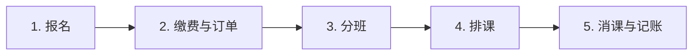
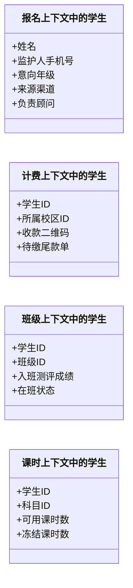
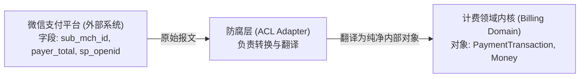
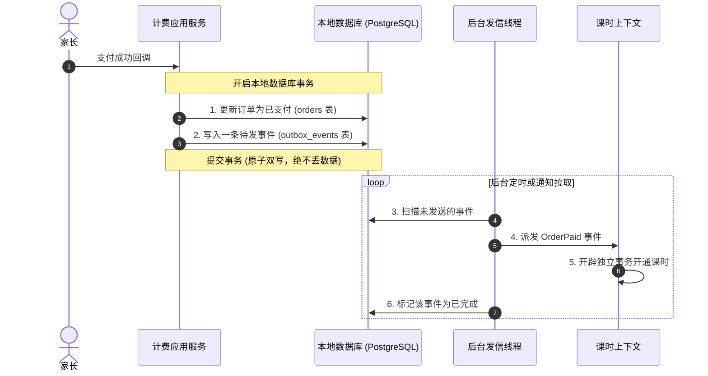

# 从理论到代码：基于小象培训管理系统的领域驱动设计 (DDD) 实战精要

> **适用场景**：40 分钟技术团队内部分享 / 架构研讨  
> **作者**：TimeCraker  
> **实战项目**：小象培训班管理系统 (`xiaoxiang-training-management`)  
> **技术栈**：TypeScript / NestJS / PostgreSQL / MikroORM  

---

### 导读：DDD 究竟要根治哪三种传统架构病症？

在讨论领域驱动设计（DDD）的正面武器之前，我们先认识三种传统架构中非常典型的**反模式（Anti-Pattern）**。之所以先摆出它们，是因为 DDD 的整套理论体系就是针对这三种病症开出的药方。理解了病灶，后面的药理才看得懂。

1. **反模式一：贫血模型（Anemic Domain Model）**  
   这个概念最早由 Martin Fowler（敏捷宣言起草人、《重构》作者）在 2003 年发表的同名文章中系统性批判。它描述的现象是：我们平时写 Java 或 TypeScript 代码时，经常定义一个实体类，里面除了字段属性，就只有一堆 `getter` 和 `setter`。这个类自己没有任何业务判断能力，就像一个没有任何血肉和思维的纯数据容器。业务校验、金额计算、状态修改全都被写在外部的各个 Service 里面。Martin Fowler 原话指出：这是软件设计中最常见的反模式之一，它完全违背了面向对象的核心原则。  
   **DDD 的对症药方：充血聚合根（Rich Aggregate Root）**——把业务规则和状态流转锁死在对象内部，外部只能通过具象的业务意图方法（如 `order.cancel(reason)`）推进状态。
2. **反模式二：上帝类（God Class / The Blob）**  
   这一反模式在 1998 年经典架构专著《AntiPatterns: Refactoring Software, Architectures, and Projects in Crisis》中被正式定义为头号坏味道。因为实体类自身没有逻辑（贫血），所有的业务判断就只能往 Service 里放。随着功能不断增加，一个 `OrderService` 或者 `StudentService` 逐渐膨胀到两三千行代码。它既要校验参数，又要查权限，还要算金额、改各种数据库表、调第三方接口、发短信。这个 Service 无所不知、无所不包。代价是代码极度臃肿，谁也不敢轻易修改，改动一处经常引发三处意想不到的 bug。  
   **DDD 的对症药方：单事务单聚合 + 领域服务**——将逻辑从"上帝"身上分散下沉到各个职责清晰的领域对象中。
3. **反模式三：大泥球（Big Ball of Mud）**  
   由 Brian Foote 和 Joseph Yoder 在 1997 年同名经典论文中定义，后被 Eric Evans 在 DDD 奠基著作（蓝皮书）第 14 章直接引用。它描述的现象是：系统在初期开发时为了图快，没有规划清晰的模块边界。订单模块直接去改学生表，排课模块为了展示方便直接跨库关联五六张表写复杂的 SQL 查询。随着业务发展，各个模块之间盘根错节、互相依赖，代码越滚越大、混成一团，最终任何人都没有能力单独重构其中某一部分。  
   **DDD 的对症药方：限界上下文（Bounded Context）+ 统一语言（Ubiquitous Language）**——划定清晰的自治边界，各模块独立演化，从根本上阻断跨域强耦合。

DDD（Domain-Driven Design，领域驱动设计）的诞生，并不是为了发明一堆新名词去开会，而是为了解决软件工程中最实在的一个痛点：**当业务越来越复杂的时候，如何让代码逻辑清晰、职责内聚、易于维护和演进。**

接下来，我们以一套真实运行的小象培训班管理系统为例，逐一拆解 DDD 的每个核心概念。我们会坚持一个原则：**先讲清楚这个概念是什么意思、为了解决什么问题，再摆出传统写法有什么毛病，最后看项目中真实的 TypeScript 代码是怎么落地的。**

---

## 第一章 业务背景与架构选型

### 1.1 小象培训班的核心业务流程

为了让后面的所有代码和模型不变成空中楼阁，我们先用几分钟了解这个系统的业务场景。

一家线下培训机构的日常运营，核心围绕五个连续的业务动作展开：



1. **报名**：家长可以在小程序上给孩子报名体验课或者正式课程。报名时支持一次选择多门科目（比如同时报数学和英语）。系统在记录报名信息的同时，会自动赠送一定数量的试听课时。
2. **缴费与订单**：家长决定购买课程，系统生成订单。这里有真实的财务规则：支持全款支付，也支持“30% 首付 + 尾款”的分期支付形态；如果是多门课程打包售卖（比如 2999 元包含语数英三门课），必须把总金额按规则分摊给各个科目，而且分摊后的金额相加必须分毫不差；如果是分期，尾款的截止日期必须在首付款成功支付后的第 30 天 23:59:59 自动推导，逾期需要触发催缴。
3. **分班**：学生缴费或者领到试听课后，进入待分班名单。教务老师根据孩子的年级、评测成绩以及班级人数上限（比如小班上限 12 人），安排学生进入对应的班级。一个学生在同一门科目下，同一时间只能处于一个有效班级中，绝对不能出现一个学生同时在两个英语一班里的混乱情况。
4. **排课**：教研老师制定周期排课规则，比如“每周二、周四晚上 18:30 到 20:00，在 302 教室由王老师上课”。排课系统需要自动把这个规则沿时间轴展开成一学期几十次具体的课次，并在排课时自动检查冲突（同一个教室同一时间不能有两门课，同一个老师同一时间不能在两个教室上课）。
5. **消课与记账**：单次课程结束后，老师发起消课。系统扣除出勤学生的课时，并在课时账本上记录一笔复式流水。如果试听学生的课时扣完变零，系统会自动把该学生从班级名单中移出，释放名额给其他付费学员。

---

### 1.2 为什么传统三层 CRUD 会越写越乱？

在传统的三层架构（Controller 控制器、Service 业务层、DAO/Mapper 数据访问层）中，大家的开发习惯往往是“先去数据库建表，建完表用工具生成代码，然后把所有的业务逻辑都写在 Service 里”。

面对上面这套业务，传统写法会遇到三个非常典型的瓶颈：

#### 瓶颈一：状态流转没有保护，任何人都能在任何地方改状态
在传统贫血模型中，`Order` 实体只有类似这样的代码：
```typescript
// 传统贫血模型：只有属性和 getter/setter
export class Order {
  id: string;
  status: string; // 'PENDING', 'PAID', 'CANCELLED'
  amount: number;
}
```
这意味着系统里任何地方（某个 Controller、定时任务脚本、甚至异步回调函数），只要拿到这个 `order` 对象，都能写一行：
```typescript
order.status = "PAID";
await orderDao.update(order);
```
没有任何地方能拦截非法操作。比如一个订单明明已经因为超时被取消（`CANCELLED`）了，结果某处的补偿代码直接把它改成了 `PAID`，绕过了金额比对，也没有生成对应的课时。业务规则全靠写代码的人心里记着，只要有人漏写了一个 `if` 判断，脏数据就进库了。

#### 瓶颈二：复杂的计算逻辑散落各处，极易算错
比如多门课程打包销售时的金额分摊，如果写在 Service 里：
```typescript
// 传统写法：在 Service 里面用普通数字到处算
const totalAmount = 2999;
const item1 = Math.floor(totalAmount * (1200 / 3000));
const item2 = Math.floor(totalAmount * (1800 / 3000));
// 如果除不尽，少算了 1 分钱，谁来兜底？
// 这段计算如果另一个财务导出的 Service 也要用，往往就是把代码复制一份过去
```
一旦分摊规则改动，所有复制过这段代码的 Service 都要改一遍，极易遗漏，月度对账就会导致大量的平账差错。

#### 瓶颈三：跨模块大联表，数据库层死锁在一起
为了在前端展示一个学员报了什么课、在哪个班、剩多少课时，开发人员往往会写一个关联了 5 张表的复杂 SQL：
```sql
SELECT * FROM orders o
JOIN students s ON o.student_id = s.id
JOIN classes c ON s.class_id = c.id
JOIN entitlement_accounts e ON s.id = e.student_id;
```
这张 SQL 把订单、学生、班级、课时四个模块在数据库层紧紧绑在了一起。以后只要课时模块想改表结构，所有牵扯到这段 SQL 的接口全都会报错。随着业务规模扩大，代码越来越难维护，改动任何一个小功能都伴随着未知的风险。这就是前文所说的代码变成了一团解不开的“烂泥球”。

---

### 1.3 选择性 DDD：不要搞教条主义

看到这里，有人可能会想：那我们把系统里所有的功能全部用 DDD 重写一遍，是不是就好了？

答案是：**千万不要这么做。**

DDD 是一把重型武器。它要求定义值对象、聚合根、接口契约、映射层，这些都会带来额外的代码量和学习成本。如果一个模块本身业务就非常简单，比如“校区基本信息维护”或者“系统字典配置”，它本质上就是几张界面的单表增删改查，如果给它也硬套一套聚合根和防腐层，纯粹是给自己找麻烦。

因此，在小象培训管理系统中，我们采用的是 **选择性 DDD（Selective DDD）**：

| 模块分类 | 包含的具体业务 | 采用的架构 | 原因 |
|---|---|---|---|
| **核心域** | 报名、计费与订单、班级、排课、课时权益 | **严格 DDD 架构**（充血聚合根、端口适配器、防腐层） | 业务规则复杂，涉及资金安全、课时审计、排课冲突，必须由核心模型牢牢守住规则。 |
| **支撑域** | 产品目录（课程商品）、学生档案、校区管理 | **经典三层 CRUD**（Controller → Service → Entity） | 业务极其稳定，以属性展示和配置为主，三层开发最快、最省成本。 |
| **通用域** | 权限登录、短信发送、系统公共配置 | **通用模块 / SDK 适配器** | 纯粹的技术支撑能力，不需要建立复杂的业务领域模型。 |

分清轻重缓急，把精力集中在最核心、最复杂的业务上，这是落地 DDD 的第一个实用心智。

---

## 第二章 战略设计：划定系统的业务边界

如果把写代码比作盖房子，战略设计就是城市规划。如果城市规划把工业区和生活区混在一起，单栋房子建得再漂亮，居住体验也是一团糟。

战略设计只解决两个问题：
1. 大家说话用不用同一个词汇（统一语言）？
2. 整个大系统拆成几个独立的小王国，各自管什么、不管什么（限界上下文）？

---

### 2.1 统一语言 (Ubiquitous Language)

#### 什么是统一语言？
在很多团队中，业务人员、产品经理和开发人员各说各的话。业务人员说“家长报了个体验课”，产品文档里写着“试听活动”，开发人员在数据库里建了个字段叫 `is_auditing`，过两个月新来的开发又在另一个表里加了个 `trial_flag`。大家以为在聊同一件事，实际上一对细节漏洞百出。

**统一语言的要求很简单：系统里的核心业务词汇，业务、产品和研发必须统一，并且这个词汇必须直接体现在代码中。**

#### 小象系统中的实践：
在小象系统中，针对“试听”和“付款”，团队统一了明确的定义，并直接写成了代码类型：

```typescript
// 统一语言落地为强类型代码定义
// 1. 课时账户类型：试听课 (TRIAL)、正式课 (FORMAL)、赠送课 (GIFT)，严禁造其他缩写
export type EntitlementAccountType = "TRIAL" | "FORMAL" | "GIFT";

// 2. 付款方式：全款支付 (FULL)、分期首付 (INSTALLMENT)
export type PaymentForm = "FULL" | "INSTALLMENT";

// 3. 首付款比例：DepositRatio，系统明确规定首付款按 30% 计算，不允许代码里随便传别的数字
export class DepositRatio extends ValueObject<number> { ... }
```
当业务人员说“首付款比例”时，开发人员脑子里对应的就是 `DepositRatio`；当运营问“正式课时”时，代码里找的就是 `FORMAL` 类型的账户。不需要中介翻译，代码就是活的业务规范。

---

### 2.2 限界上下文 (Bounded Context)

#### 什么是限界上下文？
“限界”就是边界，“上下文”就是语境。合起来的意思是：**任何一个业务概念，都只有在它特定的业务语境下才有明确、唯一的含义。**

在传统设计中，很多团队喜欢建一个全局通用的“大上帝表”。比如 `Student` 表，里面塞了 70 多个字段：既有学生姓名、出生年月、家庭住址，又有负责的课程顾问、意向科目、考试分数，还有累计缴了多少钱、欠多少尾款、上周上了哪节课。

这种“大一统模型”非常脆弱：顾问只想改个意向级别，结果要把整个包含了财务信息的对象读出来再存回去，极易产生并发覆盖；而且任何人想改一个字段，所有人都要跟着测试。

#### DDD 的做法：按业务边界拆分上下文
在小象系统中，同一个现实生活中的“学生”，在不同的限界上下文里，被拆成了各自完全独立的模型：



- **在报名上下文（Enrollment）**：系统根本不管这个学生欠多少尾款。它眼里的学生是一个销售线索，只关心姓名、家长电话、来源渠道和跟进顾问。
- **在计费上下文（Billing）**：系统根本不在乎这个学生读几年级、喜欢什么老师。它只把学生看作一个付款人编号，关心他绑定的收费二维码和待缴尾款记录。
- **在班级上下文（Classes）**：系统只关心该学生的学段、分班成绩以及是否在这个班级名单里。
- **在课时上下文（Entitlement）**：系统只把它看作一个课时资产账户，只记录可用课时和扣除记录。

这四个上下文里各自都有一个与学生相关的概念，但它们的数据表是彻底分开的，代码也是彻底分开的。它们之间唯一的联系，就是一个纯字符串的唯一标识符 `StudentId`。这样一来，报名业务改字段，绝对不会影响到计费和课时。

---

### 2.3 上下文映射 (Context Map) 与防腐层 (ACL)

当边界划好之后，不同的上下文之间怎么打交道？这就是上下文映射（Context Map）。

其中最实用、最重要的设计模式叫 **防腐层（Anti-Corruption Layer，简称 ACL）**。

#### 什么是防腐层？
当我们的核心系统需要调用外部系统（比如微信支付、第三方短信接口、或者公司的遗留老系统）时，外部系统的数据格式通常很别扭，命名规则也跟我们内部不一样。
如果我们在自己的业务代码里到处直接调用微信支付的 SDK，到处写微信返回的 `sp_openid`、`sub_mch_id`、`total_fee`，这些晦涩难懂的外来名词就会像毒素一样，把我们原本干净清爽的业务代码弄得乱七八糟。

**防腐层的做法就是在业务系统和外部系统之间修一堵防火墙。外部数据一进来，防腐层立刻把它翻译成我们自己定义的干净模型；核心业务代码只跟翻译后的干净模型打交道，对外部接口的丑陋细节一无所知。**



在小象系统的计费模块中，微信支付接口返回的回调报文，在进入领域层之前，就被 `wechat-payment.repository.ts` 适配器拦截，提取出金额并包装成我们自己的 `Money` 值对象，状态转换成统一的 `OrderStatus`。哪怕明天微信支付接口字段全面改版，我们也只需要修改防腐层这一个文件，核心订单逻辑一行代码都不需要动。

---

## 第三章 战术设计：写出真正有防御力的代码

如果说战略设计是画出图纸，战术设计就是具体搬砖砌墙的工艺。战术设计提供了几个非常具体的核心零件：**值对象、实体、聚合根、领域服务、领域事件**。

---

### 3.1 值对象 (Value Object)：消灭代码里的隐式错误

#### 什么是值对象？
用一句话概括：**值对象是用来描述事物特征、本身没有唯一标识、并且一旦创建就绝对不可变的对象。**

在传统代码中，大家特别习惯用基础类型（数字、字符串）来表示业务概念，这在编程领域叫“基本类型偏执”。
比如写一个函数：
```typescript
function pay(amount: number, phone: string) { ... }
```
这个函数非常危险：
1. `amount` 是不是负数？有没有小数位？是元还是分？不知道。调用方传个 `-100`，编译器完全不报错。
2. `phone` 是不是合法的手机号？有没有带国家区号？调用方传个 `"abc"`，也能正常传进去。

值对象就是为了解决这个问题而生的。它有三个鲜明特征：
1. **不可变**：创建之后不能改。想改？返回一个全新的对象。
2. **基于属性判等**：没有 ID。只要属性一样，就是同一个值（比如一张百元大钞，不管编号是啥，面值 100 元就等价于另一张 100 元）。
3. **自我校验**：在构造的那一刻就检查自己的合法性。系统中绝不可能存在一个“金额为负数”的 Money 对象。

#### 项目真实源码剖析：`Money` 值对象
下面是小象系统中真实使用的 `Money` 值对象核心代码（节选自 `apps/server/src/domain-shared/values/money.ts`）：

```typescript
import { ValueObject } from "../base/value-object.base";
import { BusinessRuleViolationException } from "../exceptions/domain.exception";

// 值对象内部持有的数据结构：全部标为 readonly，外部不可修改
interface MoneyValue {
  readonly amountMinor: number; // 最小货币单位（分），必须是整数
  readonly currency: string;    // 货币代码，固定 3 位大写，如 CNY
}

export class Money extends ValueObject<MoneyValue> {
  // 私有构造函数，强制外面必须通过静态 create 方法创建
  private constructor(value: MoneyValue) {
    super(value);
  }

  // 核心校验逻辑：在对象出生的一瞬间把关
  protected validate(value: MoneyValue): void {
    const { amountMinor, currency } = value;
    
    // 门禁 1：金额必须是非负整数，杜绝浮点数和小数分
    if (!Number.isInteger(amountMinor) || amountMinor < 0) {
      throw new BusinessRuleViolationException(
        `金额必须是非负整数（单位为分），实际收到: ${amountMinor}`
      );
    }
    
    // 门禁 2：币种必须是合法的 3 位大写字母
    if (!currency || !/^[A-Z]{3}$/.test(currency)) {
      throw new BusinessRuleViolationException(
        `币种必须是 3 位大写代码，实际收到: ${currency}`
      );
    }
  }

  get amountMinor(): number {
    return this.value.amountMinor;
  }

  get currency(): string {
    return this.value.currency;
  }

  // 静态安全工厂
  static create(amountMinor: number, currency = "CNY"): Money {
    return new Money({ amountMinor, currency });
  }

  // 业务方法：两笔钱相加
  add(other: Money): Money {
    // 门禁 3：不同币种不能直接加，直接拦截
    if (this.currency !== other.currency) {
      throw new BusinessRuleViolationException("不同币种无法直接相加");
    }
    // 关键特征：不可变！计算结果返回一个全新的 Money 对象
    return new Money({
      amountMinor: this.amountMinor + other.amountMinor,
      currency: this.currency,
    });
  }

  // 业务方法：扣减
  subtract(other: Money): Money {
    if (this.currency !== other.currency) {
      throw new BusinessRuleViolationException("不同币种无法直接扣减");
    }
    const remain = this.amountMinor - other.amountMinor;
    if (remain < 0) {
      throw new BusinessRuleViolationException("余额不足，扣减后不能为负数");
    }
    return new Money({ amountMinor: remain, currency: this.currency });
  }
}
```

看这段代码带来的好处：在后续写订单计算、分摊、支付的任何地方，只要方法的参数类型写的是 `Money`，你就**完全不需要再去写 `if (amount < 0)` 这种重复的校验代码**。非法数据在最外层就被挡回去了，后面的核心代码可以百分之百放心地进行计算。

#### 另一个生活化的值对象案例：`LessonQuantity`（课时数量）
除了钱，系统中还有一个高频概念是“课时”。传统写法同样喜欢用 `number`：
```typescript
// 传统写法：扣减课时
function deduct(studentId: string, lessons: number) {
  // 如果调用方不小心传了个 -2，不仅没扣课时，反而给学生倒贴了 2 节课！
  // 如果学生只剩 1 节课，调用方扣了 2 节，课时变成了 -1，负数余额进入数据库。
}
```
在小象系统中，我们为此专门建立了 `LessonQuantity` 值对象（节选自 `domain-shared/values/lesson-quantity.ts`）：
```typescript
export class LessonQuantity extends ValueObject<number> {
  protected validate(value: number): void {
    // 强制只能是非负整数，不允许负课时，也不允许小数课时
    if (!Number.isInteger(value) || value < 0) {
      throw new BusinessRuleViolationException(`课时必须为非负整数，收到: ${value}`);
    }
  }

  // 业务扣减：直接把“不允许负余额”的铁律锁死在对象内部
  subtract(other: LessonQuantity): LessonQuantity {
    const remain = this.value - other.value;
    if (remain < 0) {
      throw new BusinessRuleViolationException(
        `课时扣减后不能为负数（当前剩余: ${this.value}，尝试扣减: ${other.value}）`
      );
    }
    return new LessonQuantity(remain);
  }
}
```
有了 `LessonQuantity`，消课和赠课的逻辑只要调用 `account.deduct(LessonQuantity.create(1))`，系统在语言级别就杜绝了“负课时”和“倒贴课时”的可能。这种把校验下沉到最底层对象的做法，比在几百个 Service 顶部反复写 `if-else` 要坚固得多。

---

### 3.2 实体 (Entity)：关心“他是谁”与生命周期

#### 什么是实体？
实体刚好和值对象相反：**实体具有唯一的身份标识（ID），并且在它的整个生命周期中，状态会不断发生变化。**

例如系统里的学生 `Student`：学生今天 8 岁，明年 9 岁；今天叫小明，明天改名叫大明。虽然他的年龄和名字变了，但他依然是同一个人，因为他的学生 ID 没有变。

在实际代码中，实体分为两种：
1. **聚合根实体**：系统的门面，比如 `Order`（订单）。
2. **聚合内部的局部实体**：依附于聚合根存在的小实体，比如 `OrderItem`（订单里的明细商品行）。外部代码绝不能单独去修改一个 `OrderItem`，它的增删改查必须全部由 `Order` 这个大家长说了算。

---

### 3.3 聚合与聚合根 (Aggregate Root)：业务规则的守护神

这是战术设计中最核心的概念。

#### 什么是聚合与聚合根？
我们用生活中的例子来理解：**电脑主机就是聚合，主板上的 CPU、内存条、固态硬盘就是内部组件，而机箱外部的电源开关键就是聚合根。**
外部用户想要开机或者关机，只能按机箱面板上的电源键（聚合根暴露的方法）。你绝不允许用户直接拿把螺丝刀捅到机箱内部去短接主板线路（绕过聚合根直接改内部数据）。

聚合根有三个铁律：
1. **它是外部访问的唯一入口**：要修改订单里的商品明细？找订单聚合根。要修改班级里的学生名单？找班级聚合根。
2. **它负责守护“不变性”（业务规则恒成立）**：什么是“不变性”？比如“订单各科目分摊金额之和，必须分毫不差等于订单总金额”。这个规则必须由聚合根自己检查，不符合规则就直接报错拒绝。
3. **一个事务只修改一个聚合根**：一次数据库操作，只能改一个聚合。想改别的聚合？发事件异步通知。

#### 项目真实源码剖析：`Order` 聚合根中的收入分摊算法
以下代码节选自 `apps/server/src/bounded-contexts/billing/domain/order/order.aggregate.ts`，展示了聚合根如何在自己体内保护业务规则：

```typescript
import { AggregateRootBase, Money, OrderId, StudentId, CampusId } from "../../../../domain-shared";
import { OrderItem } from "./order-item";
import { OrderSkuRevenueAllocation } from "./order-sku-revenue-allocation";
import { OrderStatus } from "./order-status.vo";
import { OrderNotCancellable, BusinessRuleViolationException } from "../errors";

export class Order extends AggregateRootBase<OrderId> {
  // 关键设计：内部所有集合全部私有 (private)，外面连 push 的机会都没有
  private readonly _items: OrderItem[] = [];
  private readonly _allocations: OrderSkuRevenueAllocation[] = [];
  private _status: OrderStatus;
  private _receivableAmount: Money;

  // 工厂创建方法
  static create(params: {
    studentId: string;
    campusId: string;
    totalAmount: number;
    items: Array<{ skuId: string; unitPrice: number }>;
  }): Order {
    if (!params.items || params.items.length === 0) {
      throw new BusinessRuleViolationException("创建订单必须包含至少一门课程明细");
    }

    const order = new Order(
      OrderId.generate(),
      StudentId.create(params.studentId),
      CampusId.create(params.campusId),
      Money.create(params.totalAmount, "CNY"),
      OrderStatus.pendingPayment() // 新建订单初始状态必然是待支付
    );

    // 把明细塞进内部
    for (const item of params.items) {
      order._items.push(OrderItem.create({ ...item, orderId: order.id.value }));
    }

    // 核心行为：在创建订单的同时，在自己内部计算并冻结财务分摊规则
    order.freezeAllocations();

    return order;
  }

  /**
   * 聚合根内部守护的不变性规则：
   * 无论各科目的标价怎么除不尽，所有科目分摊的金额加起来，必须分毫不差等于总金额！
   */
  private freezeAllocations(): void {
    const totalMinor = this._receivableAmount.amountMinor;
    const totalOriginalMinor = this._items.reduce((sum, i) => sum + i.unitPrice.amountMinor, 0);

    let allocatedSum = 0;
    const count = this._items.length;

    for (let i = 0; i < count; i++) {
      const item = this._items[i];
      let itemShareMinor = 0;

      if (i === count - 1) {
        // 核心财务逻辑：最后一门课程做末位兜底！
        // 用总金额减去前面已经分摊完的所有金额，彻底消灭除不尽产生的 1 分钱差异
        itemShareMinor = totalMinor - allocatedSum;
      } else {
        // 按单价占比分配
        itemShareMinor = Math.floor((item.unitPrice.amountMinor / totalOriginalMinor) * totalMinor);
        allocatedSum += itemShareMinor;
      }

      this._allocations.push(
        OrderSkuRevenueAllocation.create({
          skuId: item.skuId,
          amount: Money.create(itemShareMinor, "CNY"),
        })
      );
    }
  }

  /**
   * 业务意图方法：取消订单
   */
  cancel(reason: string): void {
    // 状态机门禁：只有待支付状态的订单才允许取消，已付款的不能随便取消
    if (!this._status.isPendingPayment()) {
      throw new OrderNotCancellable(`当前状态为 [${this._status.code}]，不允许取消`);
    }

    this._status = OrderStatus.cancelled();
    
    // 产生领域事件：记录事实并通知外部
    this.apply(new OrderCancelledDomainEvent(this.id.value, reason));
  }
}
```

看这段代码的精妙之处：外部想取消订单，只能调 `order.cancel(reason)`，状态机校验不通过直接抛错，根本不存在被误改成其他状态的可能。金额分摊计算也不会漏掉一分钱，因为那是 `Order` 聚合根在自己内部自动算好的，外面连操心的机会都没有。

---

#### 3.4 领域服务 (Domain Service)：跨聚合的纯业务算法

#### 什么是领域服务？
有些业务行为天然不属于某一个单独的聚合根。比如"每日自动拉取微信对账单与系统内的全部支付流水进行比对，识别出多收、少收、重复收款等六类差异"。这个比对逻辑既不单属于某一个订单聚合根，也不单属于某一笔流水聚合根，它是跨越多个聚合的纯算法计算。

这种逻辑硬塞给某个聚合根会很别扭（让 `Order` 来比对？它自己都不知道微信那边长什么样），放在应用层 Service 里又会导致业务逻辑外泄到技术编排层。正确的做法是把它写成一个**无状态的领域服务**。

领域服务有两个鲜明特征：
1. **无状态（Stateless）**：它自己不持有任何数据，只接收参数、执行计算、返回结果。
2. **纯业务逻辑**：它和应用层 Service 的区别在于，领域服务只包含业务算法，不负责开事务、不负责调外部接口、不负责发消息。

在小象系统中，`reconciliation-matcher.service.ts` 就是一个典型的领域服务：它接收微信官方账单数据和本地支付流水列表，按金额和交易号进行逐条匹配，输出差错单明细清单。整个过程是纯粹的内存计算，不碰数据库、不调网络。

---

### 3.5 领域事件 (Domain Event)：已发生的重要既成事实

#### 什么是领域事件？
领域事件就是**领域里已经发生的一件重要既成事实**。注意"已经发生"这几个字——它不是一个请求，不是一个命令，而是对一个已经完成的业务动作的客观记录。

领域事件有三个核心特征：
1. **过去式命名**：`OrderPaid`（订单已支付）、`TrialExhausted`（试听课时已用尽）、`StudentEnrolled`（学生已入班）。用过去式是为了在语义上强调"这事已经板上钉钉了"。
2. **不可篡改**：事件一旦产生，它携带的数据就是只读的。不允许任何代码在事后修改事件的内容。
3. **携带必要的业务快照**：事件必须包含下游处理所需要的最少信息，不能让下游为了处理一个事件反过来再去查发送方的数据库。

#### 项目中的真实事件结构
以小象系统中最核心的"订单已支付"事件为例：

```typescript
// 领域事件定义：订单已支付
export class OrderPaidDomainEvent {
  readonly eventName = "billing.order.paid";
  readonly occurredAt: Date;

  constructor(
    readonly orderId: string,      // 哪个订单
    readonly studentId: string,    // 哪个学生
    readonly paidAmountMinor: number, // 实际支付了多少分
    readonly skuIds: string[],     // 包含哪几门课程
  ) {
    this.occurredAt = new Date();  // 事件发生的精确时间
  }
}
```

这个事件由 `Order` 聚合根在内部通过 `this.apply(new OrderPaidDomainEvent(...))` 产生，暂存在聚合根内部。等到应用层把事务提交成功后，事件被广播出去。课时上下文监听到这个事件后，在自己的独立事务里给学生开通对应科目的正式课时，整个过程与订单模块彻底解耦。

## 第四章 分层架构与依赖倒置：保护核心不被污染

很多团队说自己在用 DDD，但打开代码一看，实体类上面标满了 `@Entity`、`@Table`、`@Column`，领域服务里到处注入了数据库连接和外部 HTTP 客户端。这种代码一旦底层换个数据库或者换个框架，整个业务代码全得跟着改。

为了保护核心业务逻辑不被技术细节污染，小象系统严格落实了**六边形架构（Hexagonal Architecture）与依赖倒置原则（DIP）**。

---

### 4.1 四层目录结构与依赖方向

在系统的核心模块（如 `billing/` 计费模块）中，目录被严格切分为四层：

```
bounded-contexts/billing/
├── domain/     # 1. 领域层：最核心。只有纯 TypeScript 代码，零外部技术框架依赖
├── north/      # 2. 北向应用层：接收前端命令，开启事务，调领域对象做事
├── south/      # 3. 南向基础设施层：负责实现数据怎么存进数据库、怎么调外部接口
└── pl/         # 4. 发布语言层：对外暴露的 DTO 传参格式和事件契约
```

这里有一条绝不允许违反的红线：
> **`domain/` 目录里的代码，绝对禁止 `import` 任何数据库框架（如 MikroORM）、Web 框架（如 NestJS）或者网络库（如 Axios）。它只能使用纯粹的语言基础语法。**

---

### 4.2 依赖倒置原则 (DIP) 到底倒置了什么？

很多初学者觉得“依赖倒置”这个词非常抽象。我们用图文对比把它彻底说清楚：

- **传统依赖方式（正常依赖）**：  
  业务逻辑直接调用数据访问层（DAO）。业务代码依赖数据库代码。  
  `业务 Service` → `import MySQL_DAO`

- **依赖倒置方式（反向依赖）**：  
  业务层说："我需要一个能存取订单的东西，它长什么样由我定一个接口（Port 端口）"。  
  数据库层说："好的，我是具体的实现细节，我来遵从你定的接口"。  
  `业务 Domain (定义接口 OrderRepositoryPort)` ← `数据库 South (实现该接口)`

#### 代码实证：`domain/ports/order.repository.ts` 纯接口
看领域层内部定义的仓储接口，没有任何 SQL 和数据库包：

```typescript
import type { Order } from "../order/order.aggregate";
import type { OrderId, StudentId } from "../../../../domain-shared";

/**
 * 领域层只定义自己需要什么存取能力
 * 没有任何 ORM 和数据库的影子
 */
export interface OrderRepositoryPort {
  findById(orderId: OrderId): Promise<Order | null>;
  save(order: Order): Promise<void>;
}
```

具体这个接口怎么实现？南向基础设施层写了一个类：
```typescript
// 位于 south/adapters/order.repository.ts
export class OrderRepositoryImpl implements OrderRepositoryPort {
  constructor(private readonly em: EntityManager) {}

  async findById(orderId: OrderId): Promise<Order | null> {
    // 这里才真正用 MikroORM 从 PostgreSQL 查数据库表
    const ormEntity = await this.em.findOne(OrderOrmEntity, { id: orderId.value });
    return ormEntity ? OrderMapper.toDomain(ormEntity) : null;
  }

  async save(order: Order): Promise<void> {
    const ormEntity = OrderMapper.toPersistence(order);
    await this.em.persistAndFlush(ormEntity);
  }
}
```

#### 这种倒置带来的巨大好处：
你给 `Order` 聚合根写单元测试的时候，**根本不需要连数据库，也不需要启动复杂的后端服务器**。在内存里写一个简单的数组模拟仓储，1 秒钟就能跑完几百个核心业务测试用例。测试变得极其快速、稳定。

---

## 第五章 CQRS 与 Transactional Outbox：跨模块通信与读写分离

当系统被拆分为多个独立的上下文之后，很多团队在日常开发中会遇到两类很头疼的问题：
1. **查报表很慢、很别扭**：后台管理系统需要展示一个“校区运营大盘”，既要看销售额，又要看排课率，还要看消课数。如果强行按 DDD 的规矩，把各个聚合根一个一个从数据库加载进内存，再去拼装 DTO，性能会慢得像蜗牛。
2. **跨模块操作容易写成死锁的大事务**：学生交完钱，开发人员顺手在一个事务里把课时表改了、把微信通知发了，一旦外部接口网络卡顿，整个系统瞬间被拖垮。

为了优雅地解决这两个问题，我们来看看 **CQRS（读写分离）** 和 **Transactional Outbox（事务发件箱）** 是怎么配合工作的。

---

### 5.1 什么是 CQRS（命令查询职责分离）？

很多技术资料把 CQRS（Command Query Responsibility Segregation）说得神乎其神，好像一定要搞两套数据库、搞复杂的事件溯源。

**其实说白了，CQRS 的核心思想只有一句话：写数据和读数据，走两条完全不同的路。**

- **写通道（Command 命令通道）**：  
  只要是改变系统状态的操作（比如创建订单、取消订单、学生进班、消课），都必须严格走聚合根。为什么？因为写数据必须保证数据正确性，必须经过 `Order` 或者 `ClassGroup` 内部的门禁和业务规则校验，保证哪怕天塌下来，数据库里的核心状态也是合法的。
- **读通道（Query 查询通道）**：  
  只要是不修改数据的展示类操作（比如分页列表、运营看板、统计报表），**根本不需要去加载复杂的聚合根，更不需要在内存里把值对象拼来拼去**。怎么快就怎么查，直接写只读的 SQL 去查多表关联视图，直接映射成前端要的 DTO 扔回去。

在小象系统的 `operations-api`（运营报表模块）中，查询校区月度数据时，我们直接编写 `GetOperationsDashboardCountsHandler`，用一句高效的只读 SQL 从只读副本把数据查出来返回，耗时只有 10 毫秒。写操作保证逻辑纯洁严谨，读操作追求极致高效，两边互不打扰，这就是最实用的 CQRS。

---

### 5.2 跨模块协同：坚决消灭跨库本地大事务

讲完了读写分离，我们来看跨模块写数据的场景。

很多初学者容易写出下面这种代码：
```typescript
// ❌ 极其危险的跨模块大事务
await em.transactional(async () => {
  await orderRepo.save(order);               // 1. 改计费模块的订单表
  await entitlementRepo.save(account);      // 2. 顺便直接改课时模块的账本表！
  await wechatClient.sendTemplateNotice();  // 3. 顺便调微信接口发个模板通知！
});
```
这种代码是灾难性的：
1. **性能拖垮系统**：微信服务器万一偶尔卡顿 3 秒，数据库连接就会被这个事务一直霸占着不释放。一旦遇到做活动高并发，几百个请求一瞬间就能把数据库连接池全部耗尽，整站直接瘫痪。
2. **资金账目混乱**：万一微信发通知接口抛了个异常，原本已经付完钱的订单竟然被本地事务全部回滚了，变成未支付！家长钱扣了，系统却显示没付，客服电话立刻被打爆。
3. **架构无法拆分**：以后想把计费模块独立部署，这段代码就会彻底报错，因为跨了网络你根本没法开本地事务。

**正统的架构原则只有一条：一个本地数据库事务，严格只修改自己上下文的一张或几张表。跨模块的联动，必须走最终一致性——发事件通知下游异步处理。**

计费模块完成支付后，发出一个事件通知：“订单 X 已经付完款了”。课时模块监听到这个通知后，在自己的独立事务里给学生开通课时。

---

### 5.3 Transactional Outbox（事务发件箱）模式

但是发事件会遇到一个经典的可靠性问题：
- 如果先提交订单事务，再去往消息队列发消息：万一网络断了消息没发出去，学员付了钱却没有课时（掉单）。
- 如果先发消息，再去提交订单：万一消息发出去了，数据库提交时由于锁冲突报错回滚了，学员没付钱却白嫖到了课时。

为了彻底解决这个问题，工程上最成熟的方案就是 **Transactional Outbox（事务发件箱模式）**。

#### 核心原理：
我们不在业务代码里直接调网络发消息，而是**在数据库里建一张叫 `outbox_events` 的发件箱表**。
当订单支付成功时，**在同一个数据库事务里做两件事**：
1. 更新订单表为已支付；
2. 往 `outbox_events` 表里插一条待发通知记录。

因为在同一个事务里，这两件事要么同时成功，要么同时失败。随后，后台有一个专门的异步扫描线程，从发件箱表里捞出待发通知，稳稳当当地发给下游模块。



#### 项目真实源码：`outbox-writer.service.ts`
看小象系统中是如何严格从代码层面强制落实这一规则的：

```typescript
import { Injectable } from "@nestjs/common";
import { EntityManager } from "@mikro-orm/core";
import { type SqlEntityManager } from "@mikro-orm/postgresql";
import { OutboxEventEntity } from "./outbox-event.entity";

@Injectable()
export class OutboxWriter {
  constructor(private readonly em: EntityManager) {}

  async append(event: IntegrationEvent): Promise<void> {
    const em = this.em as unknown as SqlEntityManager;

    // 核心架构防护：必须检查当前是否处于数据库事务内部！
    // 如果有开发者试图在事务外面直接发事件，直接抛错拦截，防止出现数据丢失的漏洞
    if (!em.isInTransaction()) {
      throw new Error(
        "架构防护拦截：OutboxWriter.append 必须在数据库事务内部调用！" +
        "禁止业务数据提交与事件记录分离，否则进程崩溃可能导致丢事件。"
      );
    }

    // 与当前的业务操作共享同一个事务连接，共同提交
    const record = em.create(OutboxEventEntity, {
      eventId: event.eventId,
      eventName: event.eventName,
      payload: JSON.stringify(event.payload),
      status: "PENDING", // 状态初始为待投递
      createdAt: new Date(),
    });

    em.persist(record);
  }
}
```

---

## 第六章 仓储与双向映射器：拆开数据库与业务对象的锁链

初学 DDD 的同学经常会问一个问题：**“为什么不能直接把从数据库查出来的那个实体，拿来当业务领域对象用？非要中间再做一次对象转换，不麻烦吗？”**

答案是：**必须转换，因为它们两者的使命从根本上就是冲突的。**

### 6.1 数据库实体 vs 业务领域实体

- **数据库实体（ORM Entity）**：是为了迎合关系型数据库设计的。它需要大量的公开属性供 ORM 框架做反射注入，字段设计要考虑主外键、考虑联表索引、通常是扁平的二维结构。
- **领域实体与聚合根（Domain Model）**：是为了保护业务规则设计的。它的属性必须高度私有化，不给外部任意修改的口子，里面包含着复杂的值对象、状态机和计算方法。

如果把这两个概念强行捏成同一个类，你的领域聚合根为了让 ORM 能存进去，就不得不把所有内部字段改成 `public`，给每个字段加 `getter/setter`。一旦加了，好不容易建立起来的防御性边界瞬间荡然无存。

---

### 6.2 双向映射器 (Mapper) 的真实代码

解决这个矛盾的标准工程做法就是 **双向映射器（Bi-directional Mapper）**。
它就像一个海关翻译官，专门负责在“数据库扁平数据”和“业务充血聚合根”之间做显式翻译：
- `toDomain()`：从数据库查出数据，还原成业务聚合根；
- `toPersistence()`：业务做完决策后，把聚合根拆解成数据库能理解的扁平列。

以下是小象系统中的真实映射器代码（节选自 `order.mapper.ts`）：

```typescript
import { Order } from "../../domain/order/order.aggregate";
import { OrderOrmEntity } from "../entities/order.orm-entity";
import { Money, OrderId, StudentId, CampusId } from "../../../../domain-shared";
import { OrderStatus } from "../../domain/order/order-status.vo";

export class OrderMapper {
  /**
   * 1. 从数据库记录还原为充血领域聚合根
   */
  static toDomain(orm: OrderOrmEntity): Order {
    // 关键点：把数据库里的基础数字重新包装成强类型的值对象
    return Order.fromPersistence({
      id: OrderId.create(orm.id),
      orderNo: orm.orderNo,
      studentId: StudentId.create(orm.studentId),
      campusId: CampusId.create(orm.campusId),
      // 数据库存的是整数分，还原成具备自校验能力的 Money 对象
      receivableAmount: Money.create(orm.receivableAmountMinor, orm.currency),
      // 数据库存的是简短字符串，还原成具备合法性判断的状态对象
      status: OrderStatus.fromCode(orm.statusCode),
      version: orm.version, // 乐观锁版本号
      createdAt: orm.createdAt,
    });
  }

  /**
   * 2. 把充血领域聚合根拆解为数据库 ORM 实体
   */
  static toPersistence(domain: Order): OrderOrmEntity {
    const orm = new OrderOrmEntity();
    
    // 提取聚合根内值对象的基础标量值，存入对应的数据库字段
    orm.id = domain.id.value;
    orm.orderNo = domain.orderNo.value;
    orm.studentId = domain.studentId.value;
    orm.campusId = domain.campusId.value;
    
    // 把 Money 对象解构为基础整数存库
    orm.receivableAmountMinor = domain.receivableAmount.amountMinor;
    orm.currency = domain.receivableAmount.currency;
    
    // 把状态对象解构成简短字符串代码
    orm.statusCode = domain.status.code;
    orm.version = domain.version;

    return orm;
  }
}
```

有了这一层映射器，数据库就算为了优化查询要改列名、加索引，甚至做分库分表，也只需要修改这一处映射逻辑，上层的所有业务核心代码完全不受任何干扰。

---

## 第七章 总结与架构实战落地建议

经过以上六个章节的层层递进，我们回顾一下整套 DDD 架构是如何像咬合的齿轮一样运转起来的：

1. **战略上划清楚边界**：通过统一语言消除沟通误区；用限界上下文把大泥球拆解成独立的业务小王国；同一个学生在不同上下文里有明确的独立角色。
2. **战术上锁死业务规则**：用不可变的值对象消灭浮点数和参数合法性漏洞；用充血聚合根守护业务状态机和关键算法，绝不给外部随意篡改数据的机会。
3. **架构上切断技术污染**：依靠六边形分层和依赖倒置，让核心业务代码保持绝对纯洁，实现毫秒级的快速单元测试；依靠 Mapper 隔离数据库持久化细节。
4. **集成上依靠最终一致性**：绝不搞跨模块的大事务，依靠 Transactional Outbox 事务发件箱实现可靠的事件传递。

---

### 给开发团队的五条实用建议

最后，总结五条最实在的实战落地建议：

1. **先做人话对齐，再动笔写代码**：在没搞清楚完整的业务闭环之前，千万不要盲目去数据库建表。
2. **区分核心域，拒绝全面 DDD**：简单的增删改查继续用简单的三层写，把 DDD 用在真正多变、复杂、涉及核心利益的核心业务上。
3. **守住 domain 目录的纯洁底线**：只要在 domain 目录下看到了对数据库框架或者 Web 框架的引用，一律打回重构。
4. **一个事务只修改一个聚合根**：跨模块的联动老老实实通过事件通知异步处理，不要图省事把它们绑在同一个数据库大事务里。
5. **别把 DDD 当玄学**：DDD 的本质是面向对象编程的严谨回归。只要你的对象开始对自己负责了、不再只是个空壳子了，你就已经走在正确的 DDD 道路上了。

---

### 写在最后

回顾全文，DDD 并不是要求我们用一套复杂的仪式去替换原来的开发流程。它的核心主张始终只有一个：**让代码忠实地反映业务，让业务规则由代码自身来守护，而不是靠开发者的记忆和自觉。**

当你的 `Money` 对象在构造的那一刻就拒绝了非法金额，当你的 `Order` 聚合根在内部自动完成了分摊守恒计算，当你的 `OutboxWriter` 在事务外面被调用时直接抛出错误——这些代码不再是对数据库表的被动映射，它们变成了业务知识的主动表达。

> **代码不应是数据的死板容器，而应是业务知识的生动映射。**
